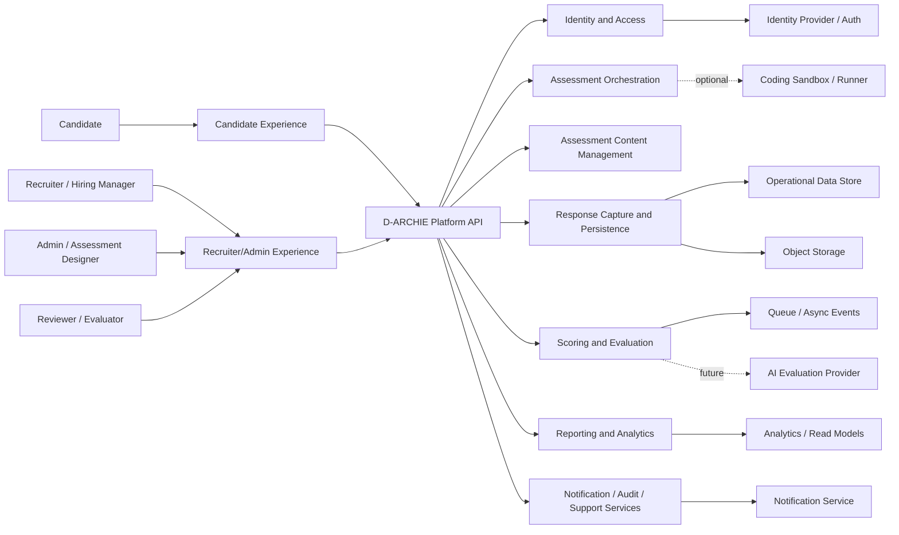
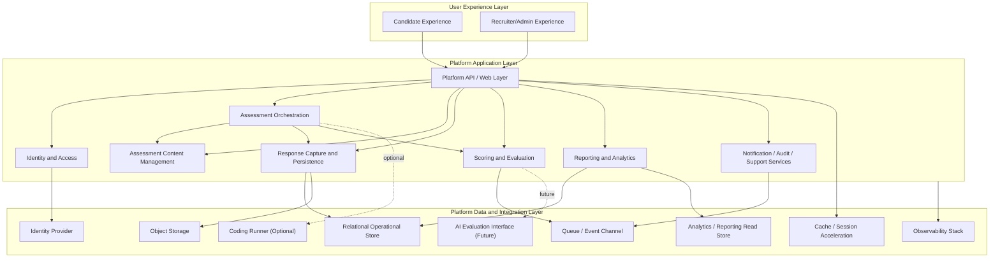
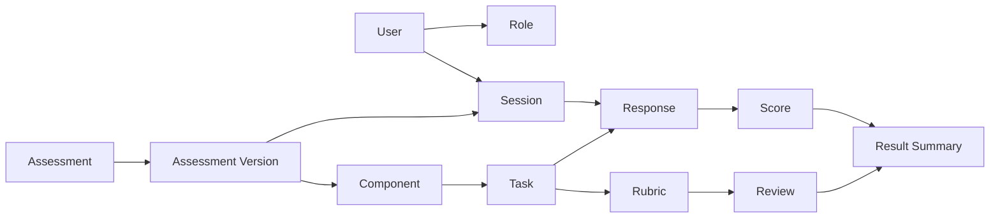
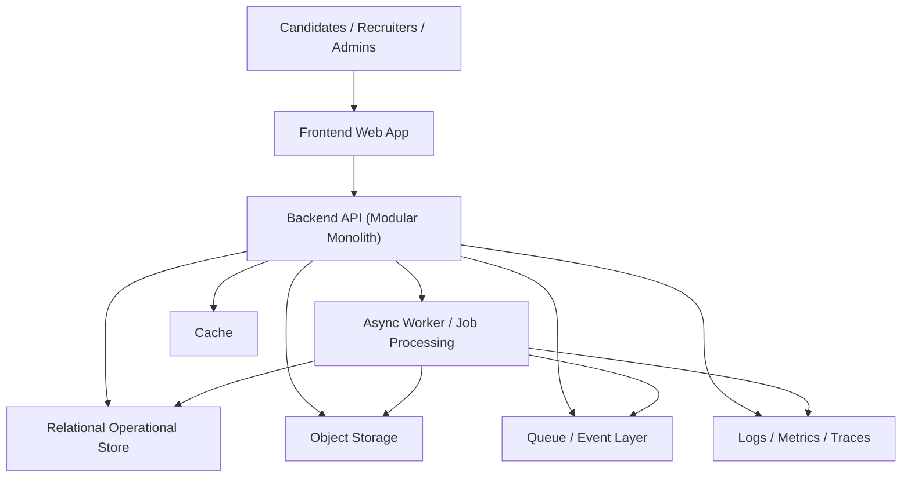

# D-ARCHIE Platform High-Level Design (HLD)

## 1. Document Overview

### 1.1 Purpose
This document defines the platform-level high-level design for D-ARCHIE. It translates the business requirements captured in the BRD into a decision-ready architecture for MVP implementation.

This HLD is intended to:
- describe how the D-ARCHIE platform works end to end,
- define the major platform modules and their responsibilities,
- clarify high-level interfaces and data flow,
- establish the MVP architecture baseline,
- provide architectural guidance for later component HLDs and LLDs.

### 1.2 Relationship to BRD
This document is the direct successor to the business requirements document:
- [`BRD.md`](/Users/varshasingh/Desktop/code_practise/PORTFOLIO/DARCHIE/docs/BRD.md)

The BRD explains why D-ARCHIE should exist and what business outcomes it must achieve. This HLD explains how the platform should be structured at a system level to deliver those outcomes.

### 1.3 Audience
This document is written for:
- product stakeholders,
- engineering leads,
- solution architects,
- backend and frontend engineers,
- platform and DevOps engineers,
- future component owners creating detailed HLD and LLD documents.

### 1.4 Scope
This is a platform-level HLD only. It covers:
- platform architecture,
- major subsystems,
- high-level interactions,
- deployment direction,
- key domain concepts,
- runtime flow overview,
- architectural principles and constraints.

This document does not define:
- endpoint-by-endpoint APIs,
- table-by-table schemas,
- component-internal class design,
- detailed scoring algorithms,
- detailed UI wireframes,
- low-level infrastructure setup.

## 2. Architecture Baseline

### 2.1 MVP Architecture Choice
The MVP architecture baseline for D-ARCHIE is a `modular monolith`.

This means:
- one primary deployable backend application,
- strong internal module boundaries,
- shared operational control plane,
- clear separation of concerns inside the application,
- ability to split modules into separate services later if scale or team structure requires it.

### 2.2 Why Modular Monolith for MVP
This is the preferred approach because the MVP needs:
- fast delivery,
- lower operational complexity,
- simple transaction boundaries,
- easier end-to-end iteration,
- reduced cost of early architecture decisions,
- enough modularity to avoid future redesign.

This approach fits D-ARCHIE because the initial platform needs tight coordination across:
- session management,
- assessment flow execution,
- response capture,
- scoring,
- reporting,
- content management.

### 2.3 Future Evolution Path
The architecture should preserve clean seams so the following modules can later be extracted if needed:
- scoring and evaluation,
- reporting and analytics,
- content management,
- coding execution/sandbox integration,
- AI-assisted evaluation services.

## 3. Architecture Principles

The platform should be designed using the following principles:

### 3.1 Business-Workflow Alignment
The architecture must support the full assessment workflow, not only isolated question delivery.

### 3.2 Modular Boundaries
Each major capability must have clear ownership and interfaces even if initially deployed within one backend.

### 3.3 Content-Execution Separation
Assessment content definition must remain logically separated from assessment execution logic.

### 3.4 Scoring Flexibility
The architecture must support:
- rule-based scoring,
- rubric-based scoring,
- manual-review-assisted scoring,
- future AI-assisted scoring.

### 3.5 Extensibility
The platform must support future task types, evaluation models, and reporting enhancements without forcing architectural replacement.

### 3.6 Reliability by Design
Candidate progress, responses, and results must be reliably stored and recoverable.

### 3.7 Observability and Auditability
The platform must provide enough logging, tracing, and auditability to support assessment fairness, issue diagnosis, and platform operations.

## 4. System Context

### 4.1 Primary Actors
- Candidate
- Recruiter
- Hiring Manager
- Admin / Assessment Designer
- Reviewer / Evaluator
- Platform Operations / Support

### 4.2 External and Supporting Systems
- Identity provider or internal authentication service
- Email/notification service
- Object storage service
- Optional coding execution environment
- Future AI evaluation provider
- Monitoring and observability tooling

### 4.3 Context Diagram

## 5. High-Level Platform Decomposition

The platform is divided into the following major modules.

### 5.1 Candidate Experience
Responsible for the candidate-facing application.

Primary responsibilities:
- assessment access and entry,
- guided task presentation,
- coding and structured response interfaces,
- progress visibility,
- autosave and submission interactions,
- candidate-friendly workflow transitions.

This module should support task types such as:
- coding tasks,
- text/structured answers,
- scenario analysis,
- design reasoning,
- visual workflow interactions,
- debugging and follow-up tasks.

### 5.2 Recruiter/Admin Experience
Responsible for recruiter, hiring manager, reviewer, and admin-facing experiences.

Primary responsibilities:
- candidate assignment and assessment launch,
- assessment configuration,
- content management access,
- reviewer workflows,
- result inspection,
- report consumption,
- platform administration.

### 5.3 Identity and Access
Responsible for user identity, authentication, and authorization.

Primary responsibilities:
- login and session identity,
- role-based access control,
- candidate assessment access control,
- admin/recruiter/reviewer permission enforcement,
- future support for external identity providers.

### 5.4 Assessment Orchestration
This is the workflow control layer of the platform.

Primary responsibilities:
- session lifecycle management,
- component progression,
- task sequencing,
- dependency and branching logic,
- timing and attempt management,
- follow-up task routing,
- handoff between content, response, and scoring modules.

This module is central to D-ARCHIE because the product is workflow-based rather than question-list-based.

### 5.5 Assessment Content Management
Responsible for storing and serving assessment definitions.

Primary responsibilities:
- assessment creation and versioning,
- component and task definitions,
- rubric definitions,
- publishing of content,
- reusable question/scenario libraries,
- configuration of follow-up logic metadata.

This module must remain logically separated from runtime execution so assessments can evolve without tightly coupling business content to backend internals.

### 5.6 Response Capture and Persistence
Responsible for storing all candidate-generated output and runtime session state.

Primary responsibilities:
- autosave,
- draft storage,
- final submissions,
- structured response persistence,
- attachment/design artifact persistence,
- session checkpointing,
- storage abstraction between relational data and object data.

### 5.7 Scoring and Evaluation
Responsible for determining and aggregating evaluation outputs.

Primary responsibilities:
- rule-based evaluation,
- rubric-linked evaluation workflows,
- manual review support,
- score aggregation,
- component-level result calculation,
- final summary generation,
- future AI-assisted evaluation integration.

### 5.8 Reporting and Analytics
Responsible for recruiter- and hiring-manager-facing performance insights.

Primary responsibilities:
- candidate score summaries,
- component-wise strengths and weaknesses,
- review-ready result views,
- aggregated reporting outputs,
- analytics-oriented read models.

### 5.9 Notification / Audit / Support Services
Responsible for supporting platform operations and communication needs.

Primary responsibilities:
- notifications and reminders,
- audit trail generation,
- platform event logging,
- issue support visibility,
- reviewer/admin operational support hooks.

## 6. Logical Architecture View

### 6.1 Logical Interaction Diagram

### 6.2 Boundary Summary
- User experience layer handles presentation and user interaction.
- Application layer owns business workflows and platform coordination.
- Data and integration layer owns persistence, asynchronous processing, and external system connections.

## 7. High-Level Runtime Flows

### 7.1 Assessment Assignment and Candidate Session Start

Flow:
1. Recruiter or admin assigns an assessment to a candidate.
2. Platform creates or links an assessment package and access path.
3. Candidate authenticates or uses secure access entry.
4. Assessment orchestration creates a session instance.
5. Session state is initialized with:
   - assessment version,
   - component order,
   - timing rules,
   - status tracking metadata.
6. Candidate experience loads the first allowed task/component.

### 7.2 Component and Task Delivery

Flow:
1. Candidate requests the next active task.
2. Orchestration resolves current session state.
3. Orchestration retrieves content metadata and task configuration.
4. Candidate experience renders the required task format.
5. Any conditional flow is resolved by orchestration, not by frontend business logic.

### 7.3 Response Submission and Autosave

Flow:
1. Candidate interacts with the task interface.
2. Frontend periodically saves draft state.
3. Response capture module persists drafts and checkpoints.
4. Final submission marks task completion and stores response metadata.
5. If attachments or design artifacts exist, they are stored in object storage and linked to the session/task record.

### 7.4 Scoring and Evaluation Flow

Flow:
1. A submission event is produced after task completion.
2. Scoring module determines the scoring path:
   - immediate rule-based evaluation,
   - rubric-based evaluation,
   - manual-review-required path,
   - hybrid path.
3. Score outputs are stored at task and component granularity.
4. Orchestration receives status updates if downstream progression depends on score or completion state.
5. Final result summaries are generated once all required components are completed and reviewed.

### 7.5 Result Aggregation and Recruiter Reporting

Flow:
1. Reporting module reads scored and reviewed outputs.
2. Reporting builds candidate summaries and component-level insights.
3. Recruiter/admin experience exposes structured results.
4. Hiring managers can interpret strengths, weaknesses, and readiness signals by component.

### 7.6 Content Authoring and Publishing Lifecycle

Flow:
1. Admin or assessment designer creates or updates assessment content.
2. Draft content is versioned in the content management module.
3. Rubrics, task definitions, and sequencing metadata are linked.
4. Review and publishing controls promote a version to active use.
5. New candidate sessions reference the published assessment version.

## 8. High-Level Domain Model

The following concepts define the platform-level domain language. Detailed schemas are deferred to LLD.

### 8.1 Core Concepts

#### `User`
Represents any platform identity such as candidate, recruiter, hiring manager, reviewer, or admin.

#### `Role`
Represents the authorization scope associated with a user.

#### `Assessment`
Represents the overall evaluation package assigned to candidates.

#### `Assessment Version`
Represents a versioned snapshot of assessment content and configuration used at runtime.

#### `Component`
Represents one of the major capability areas such as Code, Data Modelling, Data Designing, Data Processing, Data Pipeline Architecture, Data Monitoring, Data Reporting, or Data Quality / Governance.

#### `Task`
Represents an individual activity within a component.

#### `Session`
Represents a candidate-specific runtime execution instance of an assessment version.

#### `Response`
Represents candidate-generated output for a task.

#### `Score`
Represents evaluation output at task, component, or assessment level.

#### `Rubric`
Represents structured evaluation criteria used for non-trivial or subjective assessments.

#### `Review`
Represents reviewer evaluation or adjudication activity.

#### `Result Summary`
Represents the recruiter/hiring-manager-facing aggregated assessment outcome.

### 8.2 Domain Relationship View

## 9. High-Level Interfaces and Contracts

This section defines architectural interaction boundaries, not detailed APIs.

### 9.1 Candidate Client -> Platform API
Supports:
- authentication or secure access initiation,
- assessment loading,
- task retrieval,
- autosave,
- submission,
- progress retrieval.

### 9.2 Admin Client -> Platform API
Supports:
- candidate assignment,
- assessment administration,
- content authoring access,
- publishing controls,
- review workflows,
- report retrieval.

### 9.3 Platform API -> Assessment Orchestration Module
Supports:
- session creation,
- current task resolution,
- progression checks,
- component completion control,
- timing and attempt enforcement.

### 9.4 Assessment Orchestration Module -> Content Module
Supports:
- retrieval of published assessment definitions,
- retrieval of task metadata,
- retrieval of branching/follow-up rules,
- version-aware content loading.

### 9.5 Assessment Orchestration Module -> Scoring Module
Supports:
- submission evaluation initiation,
- score status retrieval,
- finalization of component and assessment status,
- review-state dependency handling.

### 9.6 Platform API / Modules -> Persistent Stores
Supports:
- operational persistence in a relational store,
- artifact persistence in object storage,
- cached access to session-sensitive data where needed,
- asynchronous event handling for background processing.

### 9.7 Platform API -> Reporting Module
Supports:
- candidate performance summary retrieval,
- recruiter/hiring-manager report views,
- analytics-oriented aggregated read access.

## 10. Technology Direction for MVP

The HLD includes recommended implementation direction at a high level. Detailed stack finalization can happen in later component HLDs.

### 10.1 Frontend
Recommended direction:
- modern SPA-style web application,
- responsive design for candidate and admin use,
- shared frontend platform with role-based experiences,
- ability to support rich interactive task formats.

### 10.2 Backend
Recommended direction:
- modular monolith backend application,
- API-first design,
- clear domain modules matching the platform decomposition,
- synchronous request/response handling plus asynchronous background processing where needed.

### 10.3 Primary Data Store
Recommended direction:
- relational database for operational data such as users, roles, assessments, sessions, responses metadata, scores, reviews, and reports metadata.

Rationale:
- strong consistency for session and workflow state,
- structured query support,
- good fit for transactional platform behavior.

### 10.4 Object / Blob Storage
Recommended direction:
- object storage for larger artifacts such as attachments, visual design outputs, exports, logs of generated artifacts, and future response evidence bundles.

### 10.5 Cache / Session Acceleration
Recommended direction:
- introduce a cache layer only where runtime responsiveness benefits from it, especially for session state lookups, published content access, and short-lived operational data.

### 10.6 Queue / Event Mechanism
Recommended direction:
- use asynchronous processing for:
  - scoring jobs,
  - report generation,
  - notifications,
  - audit/event fan-out,
  - future AI-assisted evaluation triggers.

### 10.7 Observability
Recommended direction:
- centralized logs,
- metrics,
- distributed tracing,
- operational dashboards,
- alerting on platform health and workflow failures.

## 11. AWS-First Deployment View

This section is intentionally service-category-oriented rather than low-level infrastructure-specific.

### 11.1 Deployment Posture
The MVP should assume AWS as the primary cloud target while keeping internal architecture generic enough to avoid unnecessary lock-in at the application design level.

### 11.2 AWS-Aligned Building Blocks

#### Compute
Use managed AWS compute suitable for:
- frontend hosting,
- backend application hosting,
- background workers,
- internal scheduled jobs.

#### Storage
Use AWS-aligned services for:
- relational operational storage,
- object storage,
- optional caching,
- optional analytical/read-optimized data serving.

#### Messaging
Use AWS-aligned asynchronous messaging for:
- events,
- job triggers,
- notifications,
- background workflows.

#### Security
Use AWS-aligned capabilities for:
- identity integration,
- secrets handling,
- encryption at rest and in transit,
- audit trail support.

#### Observability
Use AWS-aligned and/or compatible tooling for:
- logs,
- metrics,
- tracing,
- alerts,
- operational dashboards.

### 11.3 Deployment Topology
At a high level, the platform should include:
- hosted frontend application,
- backend API application,
- background worker capability,
- relational operational store,
- object storage,
- event/queue layer,
- observability stack.

## 12. Security, Reliability, Scalability, and Observability

### 12.1 Security Considerations
- enforce role-based access control,
- isolate candidate and admin privileges,
- secure assessment access and session identity,
- protect assessment content from unauthorized access,
- encrypt sensitive data in transit and at rest,
- maintain auditability for review and scoring operations.

### 12.2 Reliability Considerations
- autosave candidate progress,
- checkpoint session state,
- support retry-safe background processing,
- prevent accidental loss of submissions,
- provide clear task/session state transitions,
- support recovery from partial processing failures.

### 12.3 Scalability Considerations
- scale frontend and backend horizontally where practical,
- separate synchronous user interaction from asynchronous workloads,
- allow read-optimized reporting evolution,
- preserve extraction paths for scoring, reporting, and AI integration modules.

### 12.4 Observability Considerations
- trace critical workflows such as session start, submission, scoring, and report generation,
- capture audit events for admin and reviewer actions,
- monitor latency and failure rates for core user journeys,
- create alerts around scoring backlog, submission failures, and reporting delays.

## 13. Support for All 8 D-ARCHIE Assessment Components

The platform architecture supports all 8 assessment components as content- and workflow-driven capability areas rather than separate technical products.

Supported components:
1. Code
2. Data Modelling
3. Data Designing
4. Data Processing
5. Data Pipeline Architecture
6. Data Monitoring
7. Data Reporting
8. Data Quality / Governance

Architecture implication:
- components are represented through configurable content, workflow sequencing, response models, and scoring approaches,
- the same platform execution model supports all component types,
- component-specific behavior is expressed through content and module configuration rather than duplicated system architecture.

## 14. Future Extension Points

The platform must preserve the following extension points.

### 14.1 AI-Assisted Evaluation Provider Interface
Future versions may route selected responses or workflow evidence to AI-assisted evaluation services.

Architectural requirement:
- scoring module must expose a pluggable evaluation boundary,
- AI integration should remain optional and policy-controlled,
- AI outputs should support human review and auditability.

### 14.2 Coding Execution / Sandbox Integration
Code-oriented tasks may later require isolated code execution or richer automated validation.

Architectural requirement:
- orchestration should treat execution as an optional integration boundary,
- backend core should not depend on direct tight coupling to a single runner implementation.

### 14.3 External Identity Provider Interface
Enterprise customers may later require SSO or federated identity support.

Architectural requirement:
- identity and access module must remain integration-ready for external identity providers.

### 14.4 Analytics Export / Integration Interface
Enterprises may later require external analytics or HR platform integration.

Architectural requirement:
- reporting and analytics outputs should have a clean export/integration boundary.

## 15. Risks and Deferred Design Decisions

### 15.1 Risks
- scoring consistency may vary across subjective task types,
- workflow complexity can expand quickly if branching is not controlled,
- content authoring maturity may become a delivery bottleneck,
- candidate experience may degrade if too many heavy task types are introduced too early,
- reporting expectations may grow faster than MVP data modeling maturity.

### 15.2 Deferred Decisions
The following decisions are intentionally deferred to component HLDs and LLDs:
- exact frontend framework and UI component strategy,
- exact backend framework and language choice,
- detailed API shapes,
- detailed persistence schemas,
- rubric storage structure,
- reviewer workflow states,
- code execution environment design,
- analytics storage model,
- precise AWS service selection.

## 16. Validation Checklist for This HLD

This HLD should be considered acceptable if:
- a reader can trace the candidate journey from assignment to final report,
- module responsibilities are clear at platform level,
- frontend, backend, orchestration, content, scoring, and reporting boundaries are distinct,
- the architecture supports mixed task types and hybrid scoring,
- the modular monolith decision is justified for MVP,
- AWS-first deployment direction is clear without overconstraining later design,
- future AI-assisted evaluation is shown as an extension point, not an MVP dependency,
- the document naturally hands off to component-level HLDs and later LLD work.

## 17. Next Documents

The next documents that should follow this platform HLD are:

1. Frontend HLD
2. Backend HLD
3. Assessment Orchestration HLD
4. Assessment Content Management HLD
5. Scoring and Evaluation HLD
6. Reporting and Analytics HLD
7. Identity and Access HLD
8. Component-wise LLD documents
9. Implementation roadmap
10. Task backlog and delivery plan

## 18. Executive Summary

D-ARCHIE should be implemented first as a modular monolith with strong internal boundaries and AWS-first deployment assumptions. The platform is organized around candidate experience, admin experience, identity, orchestration, content management, response persistence, scoring, reporting, and support services.

This structure gives the MVP a practical balance:
- fast to deliver,
- operationally simpler than microservices,
- flexible enough to support all 8 assessment components,
- ready for hybrid scoring,
- prepared for future AI-assisted evaluation and modular extraction where needed.

This HLD establishes the system-wide architecture required to move into component HLDs and later detailed design.
