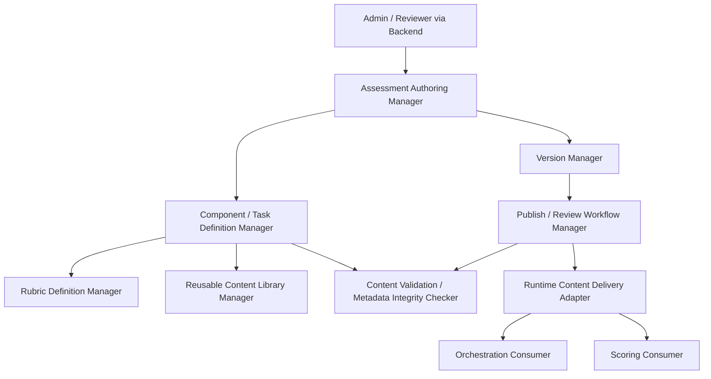
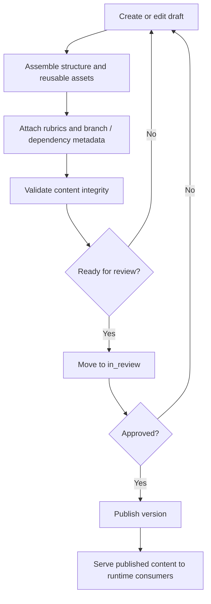
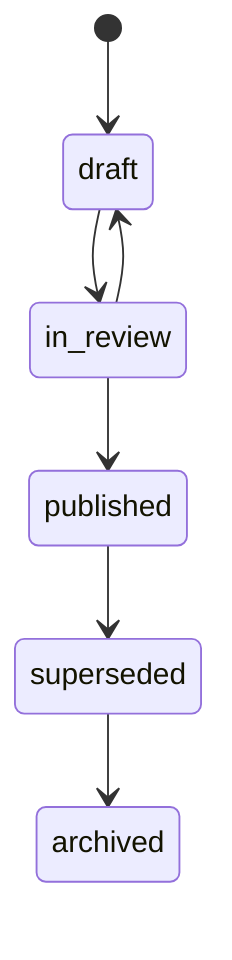

# D-ARCHIE Assessment Content Management High-Level Design (HLD)

## 1. Document Overview

### 1.1 Purpose
This document defines the high-level design for the `Assessment Content Management` component in D-ARCHIE.

The purpose of this HLD is to define the module that owns:
- authored assessment definitions,
- assessment versioning,
- component and task definitions,
- rubric definitions,
- reusable question and scenario libraries,
- follow-up, branching, dependency, and prerequisite metadata,
- content review and publishing workflow,
- delivery of published content to runtime consumers.

This HLD establishes Assessment Content Management as the source of truth for authored assessment structure while keeping runtime workflow execution outside its boundary.

### 1.2 Audience
This document is written for:
- solution architects,
- backend engineers,
- product and engineering leads,
- assessment-platform designers,
- future LLD authors,
- engineers working on orchestration, scoring, reporting, and admin tooling.

### 1.3 Relationship to Parent Documents
This component HLD is derived from:
- [`BRD.md`](/Users/varshasingh/Desktop/code_practise/PORTFOLIO/DARCHIE/docs/BRD.md)
- [`Platform-HLD.md`](/Users/varshasingh/Desktop/code_practise/PORTFOLIO/DARCHIE/docs/Platform-HLD.md)
- [`Component-HLD-Blueprint.md`](/Users/varshasingh/Desktop/code_practise/PORTFOLIO/DARCHIE/docs/Component-HLD-Blueprint.md)
- [`Assessment-Orchestration-HLD.md`](/Users/varshasingh/Desktop/code_practise/PORTFOLIO/DARCHIE/docs/Assessment-Orchestration-HLD.md)
- [`Backend-HLD.md`](/Users/varshasingh/Desktop/code_practise/PORTFOLIO/DARCHIE/docs/Backend-HLD.md)

The platform HLD establishes content management as a separate module from runtime execution. The orchestration HLD already defines that orchestration consumes published content and follow-up metadata but does not author it. This document defines the content module in detail at HLD level.

### 1.4 Scope
This HLD covers:
- authored content ownership and boundaries,
- assessment and version lifecycle,
- reusable content library management,
- rubric and metadata ownership,
- publishing and runtime delivery responsibilities,
- interfaces to admin/backend, orchestration, and scoring,
- quality attributes and failure considerations,
- handoff points for LLD.

This HLD does not cover:
- runtime workflow decisions,
- candidate response storage,
- scoring execution logic,
- reporting model ownership,
- detailed reviewer/admin UI implementation,
- endpoint-level APIs,
- database schema detail,
- AI-generated adaptive content for MVP.

## 2. Component Summary

### 2.1 Component Name
`Assessment Content Management`

### 2.2 Mission Statement
Assessment Content Management is the authored-content source of truth for D-ARCHIE, responsible for defining, versioning, validating, reviewing, publishing, and serving assessment content used by the platform.

### 2.3 Why This Component Matters
D-ARCHIE depends on structured, workflow-aware content rather than static independent questions. The platform needs a module that can:
- define assessments in a reusable and maintainable way,
- manage versioned assessment content safely,
- attach follow-up and dependency metadata to tasks,
- support rubric-linked evaluation setup,
- separate authored content from runtime session behavior,
- publish stable versions that can be safely consumed by active sessions.

Without this component, assessment definitions would be tightly coupled to runtime execution and difficult to evolve safely.

### 2.4 Role in the Platform
Assessment Content Management acts as:
- the system-of-record for authored assessment structure,
- the source of published content for orchestration and scoring,
- the owner of reusable content assets and rubric definitions,
- the governed lifecycle manager for content readiness before runtime use.

It is not the owner of workflow decisions, runtime session state, response data, or scoring outcomes.

## 3. Goals and Responsibilities

### 3.1 Primary Goals
- provide a stable source of truth for authored assessments,
- support content reuse across assessments and versions,
- separate authoring lifecycle from runtime lifecycle,
- ensure only reviewed and published content is used in active assessment sessions,
- make branching/follow-up metadata configuration explicit and maintainable,
- support future growth in assessment formats without redesigning the content model.

### 3.2 Primary Responsibilities
- create and edit assessments in authored form,
- manage assessment versions,
- define components and tasks within assessments,
- define rubric-linked evaluation metadata,
- manage reusable question and scenario libraries,
- define branching, follow-up, dependency, and prerequisite metadata,
- validate content integrity before publishing,
- manage content lifecycle through draft, review, and published states,
- serve published content to orchestration and other runtime consumers,
- preserve published-version stability for sessions already in progress.

### 3.3 Explicitly Not Owned by This Component
- runtime progression decisions,
- candidate session state,
- response persistence,
- score generation,
- result analytics,
- frontend rendering behavior,
- adaptive AI-generated content for MVP,
- detailed admin workbench UI implementation.

## 4. In Scope / Out of Scope

### 4.1 In Scope for MVP
- authored assessment creation,
- authored assessment editing,
- assessment version lifecycle,
- component definition management,
- task definition management,
- rubric definition ownership,
- first-class reusable question/scenario libraries,
- branching and follow-up metadata definition,
- dependency and prerequisite metadata definition,
- draft -> review -> published lifecycle,
- validation before publishing,
- published runtime content delivery,
- update of authored drafts without affecting already-published versions.

### 4.2 Out of Scope for MVP
- runtime workflow decision-making,
- candidate response handling,
- score execution logic,
- AI-generated content authoring,
- dynamic adaptive content generation,
- complex enterprise editorial workflow beyond the basic governed lifecycle,
- endpoint/schema-level contracts.

### 4.3 Deferred to Later Phases
- richer approval/rollback/archive workflows,
- AI-assisted authoring support,
- advanced reusable asset inheritance patterns,
- content experimentation or A/B versioning,
- more complex editorial collaboration features.

## 5. Actors and Interactions

### 5.1 User Actors
- Admin / Assessment Designer
- Reviewer / Content Approver
- Recruiter or privileged operator in limited publishing contexts

### 5.2 Internal Platform Actors
- Backend application shell
- Assessment Orchestration
- Scoring and Evaluation
- Identity and Access
- Notification / Audit / Support Services

### 5.3 External / Supporting Systems
- relational operational store,
- optional object storage for content-linked assets,
- cache for published content access optimization,
- observability stack,
- audit/event infrastructure.

### 5.4 Interaction Model Summary
- admin and reviewer actions reach the module through the backend API surface,
- content authoring operations mutate drafts and versions,
- orchestration consumes only published content and runtime-safe metadata,
- scoring consumes rubric and task-linked evaluation metadata,
- backend hosts the module but does not own content semantics,
- runtime consumers never mutate authored content definitions during candidate execution.

## 6. Component Boundaries and Dependencies

### 6.1 Boundary Definition
Assessment Content Management begins when authored content is created, edited, reviewed, versioned, validated, published, or retrieved as published runtime content. It ends when content state or content delivery outcomes have been resolved within the content-authoring boundary.

It owns:
- authored assessment structure,
- authored versions,
- reusable content assets,
- rubric definitions,
- branch/follow-up metadata definitions,
- publishing readiness state,
- published content delivery responsibility.

It does not own:
- runtime interpretation of published metadata,
- workflow progression decisions,
- candidate submissions,
- score computation,
- report generation.

### 6.2 Upstream Dependencies
Upstream callers include:
- backend API handling admin/reviewer authoring operations,
- orchestration requesting published runtime content,
- scoring requesting rubric-linked metadata.

### 6.3 Downstream Dependencies
Assessment Content Management depends on:
- backend hosting and request routing,
- persistence layers for authored and published content storage,
- cache for published-content acceleration where needed,
- audit/observability services,
- identity/access context for author/reviewer/publisher permissions.

### 6.4 Synchronous Interactions
- create or update draft content,
- retrieve reusable assets,
- validate content,
- fetch published assessment versions,
- fetch branch/follow-up metadata,
- fetch rubric metadata.

### 6.5 Asynchronous Interactions
- publish-related event emission,
- review-submission notifications,
- content supersession notifications,
- optional publish-cache refresh or derived-content refresh.

### 6.6 Critical Dependency Rules
- content management defines branch/follow-up metadata but does not decide runtime branch outcomes,
- orchestration consumes published content but does not mutate authored definitions,
- scoring consumes rubric-linked content but does not own rubric definitions,
- published versions must remain stable for active sessions even when newer drafts exist,
- backend hosts the module but does not own content semantics.

## 7. Internal Logical Decomposition

The component should be logically organized into the following capability areas.

### 7.1 Assessment Authoring Manager
Responsible for:
- assessment draft creation,
- authored assessment editing,
- content assembly and organization,
- authoring operations over components and tasks.

### 7.2 Version Manager
Responsible for:
- creation and tracking of assessment versions,
- separation of draft and published versions,
- preserving published-version immutability semantics at HLD level,
- associating active sessions to stable published versions.

### 7.3 Component / Task Definition Manager
Responsible for:
- defining assessment components,
- defining tasks and task metadata,
- organizing order and authored structural relationships,
- attaching prerequisite and dependency configuration.

### 7.4 Rubric Definition Manager
Responsible for:
- rubric creation and association,
- linking rubrics to components/tasks,
- exposing rubric-linked metadata for evaluation consumers.

### 7.5 Reusable Content Library Manager
Responsible for:
- reusable question/scenario asset management,
- asset lookup and reuse,
- enabling assessments to assemble from reusable content blocks,
- preserving clear boundaries between library assets and authored assessment versions.

### 7.6 Publish / Review Workflow Manager
Responsible for:
- content lifecycle transitions,
- review submission,
- publish readiness control,
- publish promotion and version release markers.

### 7.7 Runtime Content Delivery Adapter
Responsible for:
- retrieving published content for runtime consumers,
- serving runtime-safe assessment structure,
- serving branch/follow-up/prerequisite metadata to orchestration,
- serving rubric-linked task metadata to scoring.

### 7.8 Content Validation / Metadata Integrity Checker
Responsible for:
- validating content completeness,
- validating branch/follow-up references,
- validating prerequisite/dependency integrity,
- validating publish-readiness rules at high level.

### 7.9 Internal Logical Decomposition Diagram

## 8. Runtime and Authoring Flows

### 8.1 Create or Edit Assessment Draft

Flow:
1. Admin starts a new assessment draft or opens an existing draft.
2. Backend routes the request to Assessment Content Management.
3. Assessment Authoring Manager loads or creates the authored assessment context.
4. Components, tasks, rubrics, and reusable assets are attached or updated.
5. Draft state is persisted without affecting any published version currently used at runtime.

### 8.2 Assemble Assessment from Reusable Content Assets

Flow:
1. Author searches reusable content libraries.
2. Reusable Content Library Manager returns candidate assets.
3. Author selects assets for inclusion in an assessment draft.
4. Component / Task Definition Manager links or composes the selected content into the assessment structure.
5. Author may further enrich the draft with rubric, prerequisite, dependency, or follow-up metadata.

### 8.3 Attach Components, Tasks, Rubrics, and Follow-Up Metadata

Flow:
1. Author edits the assessment structure.
2. Component / Task Definition Manager updates authored structure.
3. Rubric Definition Manager links rubric definitions where required.
4. Branching, follow-up, dependency, and prerequisite metadata are attached to the relevant authored units.
5. Content Validation / Metadata Integrity Checker verifies internal consistency.

### 8.4 Move Draft into Review and Publish a Version

Flow:
1. Author submits a draft for review.
2. Publish / Review Workflow Manager moves the content to `in_review`.
3. Validation checks confirm publish readiness.
4. Approved content is promoted to `published`.
5. Version Manager marks the version as the published runtime artifact.
6. Publish events and audit markers are emitted.

### 8.5 Fetch Published Assessment Version for Runtime Use

Flow:
1. Orchestration or scoring requests published content.
2. Runtime Content Delivery Adapter retrieves the relevant published version.
3. Only published, runtime-safe content is returned.
4. Consumers receive:
   - assessment structure,
   - component/task definitions,
   - branch/follow-up/prerequisite metadata,
   - rubric-linked metadata as needed.

### 8.6 Update Content Without Affecting In-Flight Sessions

Flow:
1. Author continues editing content after a version has been published.
2. New changes are stored in a new draft or mutable authored workspace.
3. Existing sessions remain tied to the previously published assessment version.
4. Only newly created sessions can bind to a newly published replacement version once it is approved and published.

### 8.7 Content Authoring / Publishing Flow Diagram

### 8.8 Optional Lifecycle State Diagram

The exact lifecycle rules and transition controls are deferred to LLD.

## 9. High-Level Interfaces and Contracts

This section defines content-management-facing architectural contracts, not detailed APIs.

### 9.1 Interfaces Provided by Assessment Content Management

#### Admin Client / Backend -> Assessment Content Management
High-level operations:
- create and edit assessments,
- manage authored versions,
- manage reusable content assets,
- manage rubrics and task metadata,
- submit content for review,
- publish approved content.

Interaction type:
- synchronous request/response for authoring operations, plus asynchronous publish-related eventing.

#### Assessment Orchestration -> Assessment Content Management
High-level operations:
- fetch published assessment version,
- fetch component/task structure,
- fetch branching/follow-up metadata,
- fetch dependency and prerequisite definitions.

Interaction type:
- synchronous request/response.

#### Scoring and Evaluation -> Assessment Content Management
High-level operations:
- fetch rubric definitions,
- fetch evaluation-linked task metadata,
- fetch published structure needed for evaluation context.

Interaction type:
- synchronous request/response.

### 9.2 Interfaces Consumed by Assessment Content Management

#### Assessment Content Management -> Persistence / Audit Boundaries
High-level operations:
- store drafts,
- store authored versions,
- store publish markers,
- store reusable content assets,
- store validation and audit markers.

Interaction type:
- synchronous persistence plus asynchronous event/audit emission.

#### Assessment Content Management -> Identity / Access Context
High-level operations:
- validate author/reviewer/publisher permissions,
- retrieve role-aware access context.

Interaction type:
- synchronous request/response.

### 9.3 Events Emitted or Consumed

Events emitted:
- `content_submitted_for_review`
- `content_published`
- `content_version_superseded`
- `rubric_updated`

Events consumed:
- `runtime_content_requested`
- optional review-completion or publish-notification triggers from support workflows

## 10. Domain Concepts and Data Ownership

### 10.1 Platform Concepts Owned by Assessment Content Management
- `Assessment`
- `Assessment Version`
- `Component`
- `Task`
- `Rubric`

It also owns authored metadata for:
- branch and follow-up definitions,
- prerequisite and dependency definitions,
- reusable content asset references.

### 10.2 Platform Concepts Referenced but Not Owned
- `User`
- `Role`
- `Session`
- `Response`
- `Score`
- `Review`
- `Result Summary`

### 10.3 System-of-Record Responsibilities
Assessment Content Management is system-of-record for:
- authored assessment definitions,
- authored and published assessment versions,
- component/task/rubric definitions,
- branch/follow-up/prerequisite/dependency metadata,
- reusable content library assets and their assessment-linked usage metadata.

Assessment Content Management is not system-of-record for:
- runtime session state,
- candidate responses,
- final scoring outcomes,
- reporting summaries.

### 10.4 Persistence Responsibilities
Assessment Content Management writes or coordinates writes to:
- relational operational storage for authored and published definitions,
- optional object storage for supporting content-linked assets,
- cache for published-content access acceleration where needed,
- audit/event infrastructure for review and publish lifecycle markers.

### 10.5 Records / Artifacts Produced
- authored assessment drafts,
- published assessment versions,
- component/task/rubric metadata,
- reusable content library assets and references,
- publish markers,
- validation markers,
- review-state markers,
- runtime-consumable published content payloads.

## 11. Security, Reliability, Scalability, and Observability

### 11.1 Security
- only authorized roles should create, review, or publish content,
- published content access should be protected from unauthorized mutation,
- sensitive authoring operations should be auditable,
- runtime consumers should receive only the published content they are allowed to access.

### 11.2 Reliability
- published versions must remain stable and retrievable,
- failed publish attempts must not corrupt the current published version,
- draft and published states must be clearly separated,
- validation failures must block incorrect publish actions,
- reusable asset references must remain consistent across versions.

### 11.3 Scalability
- content read patterns for runtime consumers should be optimized separately from authoring workflows,
- reusable libraries should support growth in number of assets and reuse frequency,
- published-content retrieval should not be bottlenecked by authoring activity,
- the content lifecycle model should support additional editorial states in future without redesigning the component boundary.

### 11.4 Observability
- trace authoring, review, and publishing actions,
- log validation failures and publish-blocking issues,
- monitor runtime content retrieval performance,
- audit version supersession and publish history.

## 12. Risks and Failure Considerations

### 12.1 Likely Failure Modes
- ambiguous branch/follow-up metadata causing invalid runtime behavior,
- published versions being accidentally mutated,
- reusable asset references breaking across versions,
- rubric changes affecting evaluation consistency unexpectedly,
- publish flow allowing incomplete or invalid content through.

### 12.2 Architectural Risks
- content management may become overly coupled to orchestration if runtime rules leak into authoring logic,
- content reuse can become difficult if reusable assets and authored versions are not clearly separated,
- publishing workflow can become too heavy for MVP if editorial complexity is overdesigned.

### 12.3 Mitigation Direction
- keep authored definitions separate from runtime interpretation,
- enforce stable published-version boundaries,
- validate metadata integrity before publishing,
- keep the MVP lifecycle simple but governed,
- make reusable libraries first-class but not overly abstract in HLD.

## 13. Deferred Decisions for LLD

The following decisions are intentionally deferred to LLD:
- exact schema design for authored content and versions,
- exact permission matrix for author/reviewer/publisher roles,
- exact validation rule set,
- publish conflict handling,
- asset reference model,
- API contract shapes,
- cache invalidation details,
- draft locking or concurrent editing behavior,
- rollback or archival mechanics,
- review assignment and approval mechanics.

## 14. Handoff to LLD

The LLD for Assessment Content Management should define:
- assessment and version entities,
- component/task/rubric entity structures,
- reusable asset model,
- validation rules and metadata integrity model,
- lifecycle state machine and transition conditions,
- permission and role matrix,
- publish/read APIs,
- storage schema,
- publish event contracts,
- version supersession behavior,
- runtime delivery contract shape for orchestration and scoring.

## 15. Acceptance Checklist

This HLD is acceptable if:
- authored content ownership is clearly separated from orchestration runtime ownership,
- published-version stability is clear,
- reusable question/scenario libraries are clearly first-class in MVP,
- rubric ownership is clearly placed in content management,
- branch/follow-up metadata ownership is clear while runtime decisions remain in orchestration,
- content lifecycle and publishing flow are traceable,
- deferred decisions are explicit enough for LLD work.

## 16. Future Extension Points

### 16.1 Richer Editorial Workflow
Future versions may add:
- approvals,
- rollback,
- archival,
- collaboration controls,
- editorial assignment flows.

### 16.2 AI-Assisted Authoring
Future versions may support AI-assisted content drafting, refinement, or validation.

Architectural position:
- outside MVP,
- must remain an optional extension to authoring, not a replacement for governed publishing.

### 16.3 Advanced Asset Reuse Models
Future versions may introduce richer reusable content inheritance, parameterization, or template-driven assembly.

## 17. Executive Summary

Assessment Content Management is the source of truth for authored D-ARCHIE assessment definitions. It owns assessment structure, authored versions, reusable question/scenario libraries, rubric definitions, and branch/follow-up metadata. It also governs the Draft -> Review -> Published lifecycle and serves published content to runtime consumers.

It does not own workflow execution, session state, response storage, or score generation. Instead, it supplies the stable authored and published content that orchestration and scoring rely on.

This HLD defines the component boundary needed to safely evolve assessment content while protecting active runtime sessions from unintended change.
