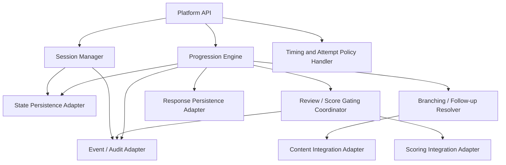
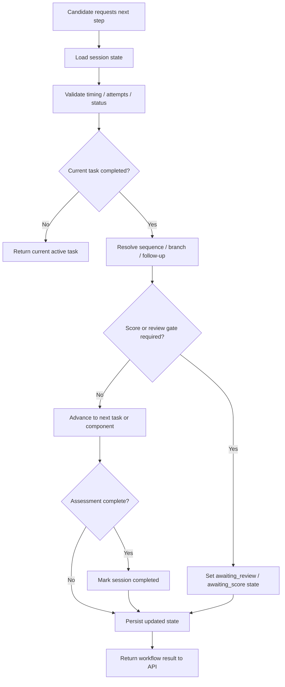

# D-ARCHIE Assessment Orchestration High-Level Design (HLD)

## 1. Document Overview

### 1.1 Purpose
This document defines the high-level design for the `Assessment Orchestration` component in D-ARCHIE.

The purpose of this HLD is to define how the platform controls assessment workflow execution, including:
- session lifecycle management,
- component and task progression,
- sequencing and dependency resolution,
- follow-up task routing,
- timing and attempt enforcement,
- progression gating based on score/review readiness,
- orchestration handoffs across content, response persistence, and scoring.

This document is intended to make the orchestration component decision-complete at architecture level while deferring implementation detail to LLD.

### 1.2 Audience
This document is written for:
- solution architects,
- backend engineers,
- platform engineers,
- product and engineering leads,
- future LLD authors,
- engineers working on content, response persistence, scoring, frontend, and reporting integrations.

### 1.3 Relationship to Parent Documents
This component HLD is derived from:
- [`BRD.md`](/Users/varshasingh/Desktop/code_practise/PORTFOLIO/DARCHIE/docs/BRD.md)
- [`Platform-HLD.md`](/Users/varshasingh/Desktop/code_practise/PORTFOLIO/DARCHIE/docs/Platform-HLD.md)
- [`Component-HLD-Blueprint.md`](/Users/varshasingh/Desktop/code_practise/PORTFOLIO/DARCHIE/docs/Component-HLD-Blueprint.md)

The BRD defines the workflow-driven nature of the product. The platform HLD establishes Assessment Orchestration as the workflow control layer. This document refines that single component in detail at HLD level.

### 1.4 Scope
This HLD covers:
- orchestration ownership and boundaries,
- orchestration runtime behavior,
- orchestration dependencies and interfaces,
- session and progression responsibilities,
- high-level state model,
- orchestration data ownership,
- quality attributes and failure considerations,
- handoff to LLD.

This HLD does not cover:
- scoring algorithms,
- detailed content authoring behavior,
- detailed response storage design,
- reviewer UI design,
- endpoint-level API contracts,
- database schema detail,
- code-runner execution as an MVP dependency,
- adaptive difficulty logic for MVP.

## 2. Component Summary

### 2.1 Component Name
`Assessment Orchestration`

### 2.2 Mission Statement
Assessment Orchestration is the workflow-control component that governs how a candidate moves through an assessment session from start to completion.

### 2.3 Why This Component Matters
D-ARCHIE is not a simple question bank or coding test runner. It is a workflow-based assessment platform covering multiple capability areas, follow-up logic, mixed task types, and hybrid evaluation modes.

The orchestration component is critical because it determines:
- what the candidate is allowed to do next,
- how tasks and components are sequenced,
- how branching logic is applied,
- when assessment flow pauses or continues,
- how review and score readiness affect progression,
- when an assessment is completed or blocked.

### 2.4 Role in the Platform
Assessment Orchestration is the operational workflow coordinator between:
- candidate/admin-facing platform APIs,
- content definitions,
- response state,
- scoring state,
- future optional execution and evaluation extensions.

It is the main owner of runtime workflow decisions in the platform.

## 3. Goals and Responsibilities

### 3.1 Primary Goals
- provide deterministic control over assessment progression,
- support multi-step and multi-component assessment workflows,
- separate workflow decisions from content definition and scoring logic,
- enforce timing and attempt rules consistently,
- support hybrid progression models that may depend on completion, score status, or manual review status,
- keep workflow behavior auditable and recoverable.

### 3.2 Primary Responsibilities
- create and manage assessment session lifecycle,
- initialize session state from a published assessment version,
- determine current active component/task,
- resolve next-step decisions after task completion,
- enforce sequencing rules,
- resolve branching and follow-up logic,
- enforce timing and attempt policies,
- coordinate progression holds for score/review-gated tasks,
- update workflow state based on downstream status changes,
- determine assessment completion, pause, expiry, or cancellation state.

### 3.3 Explicitly Not Owned by This Component
- authoring or versioning assessment content,
- rendering candidate or reviewer interfaces,
- storing raw candidate artifact content,
- computing actual evaluation logic or score values,
- producing final recruiter analytics,
- mandatory code execution integration in MVP,
- adaptive difficulty or AI-guided dynamic orchestration in MVP.

## 4. In Scope / Out of Scope

### 4.1 In Scope for MVP
- candidate session creation,
- assessment version binding to session,
- component and task progression,
- prerequisite and dependency handling,
- follow-up task routing based on configured rules,
- timing and attempt enforcement,
- progress checkpoint state management,
- gating progression on:
  - completion state,
  - score status,
  - manual review readiness,
- assessment completion logic,
- expiry, pause, and cancellation handling,
- orchestration-triggered events and state updates.

### 4.2 Out of Scope for MVP
- adaptive assessment difficulty,
- AI-generated branching decisions,
- mandatory code-runner orchestration path,
- detailed reviewer workbench orchestration,
- rich cross-assessment scheduling logic,
- scoring policy definition,
- response artifact persistence internals.

### 4.3 Deferred to Later Phases
- dynamic difficulty adjustments,
- AI-assisted follow-up selection,
- richer re-entry and resume policies,
- advanced multi-stage reviewer coordination,
- code-runner orchestration as an optional future integration.

## 5. Actors and Interactions

### 5.1 User Actors
- Candidate
- Recruiter / Admin
- Reviewer
- Hiring Manager

### 5.2 Internal Platform Actors
- Platform API / Web layer
- Assessment Content Management
- Response Capture and Persistence
- Scoring and Evaluation
- Identity and Access
- Notification / Audit / Support Services

### 5.3 External / Supporting Systems
- relational operational store,
- cache/session acceleration layer,
- event/queue layer,
- observability stack,
- future coding sandbox,
- future AI-assisted evaluation provider.

### 5.4 Interaction Model Summary
- Platform API calls orchestration synchronously for session and progression decisions.
- Orchestration reads published assessment metadata from content management.
- Orchestration persists workflow state through persistence boundaries.
- Orchestration consumes score/review readiness from scoring.
- Orchestration emits and reacts to workflow events.
- Reviewer activity affects orchestration indirectly through review status updates from scoring/review systems.

## 6. Component Boundaries and Dependencies

### 6.1 Boundary Definition
Assessment Orchestration begins when a runtime workflow decision is required and ends when that decision or state transition has been resolved and persisted.

It owns:
- workflow decisions,
- session state transitions,
- progression state,
- gating logic,
- orchestration-level policy application.

It does not own:
- the content being delivered,
- the submitted response body,
- the scoring logic itself,
- the recruiter-facing output representation.

### 6.2 Upstream Dependencies
Upstream callers include:
- Platform API for session and progression operations,
- event consumers processing submission or review completion notifications.

### 6.3 Downstream Dependencies
Assessment Orchestration depends on:
- Assessment Content Management for published assessment structure and branching metadata,
- Response Capture and Persistence for response milestone status and checkpoint persistence,
- Scoring and Evaluation for evaluation/review state and gating signals,
- Notification/Audit/Support services for operational event publication,
- cache/persistence layers for runtime state access.

### 6.4 Synchronous Interactions
- create session,
- fetch current active task/component,
- validate whether a task may start,
- resolve next progression decision,
- enforce timing or attempt constraints,
- fetch required content-linked routing metadata.

### 6.5 Asynchronous Interactions
- consume response-submitted event,
- consume evaluation-completed event,
- consume review-completed event,
- emit session-state-updated event,
- emit assessment-completed event,
- emit timeout/expiry-related events.

### 6.6 Critical Dependency Rules
- orchestration must treat content as authoritative for workflow definitions, but not for runtime state,
- orchestration must treat scoring as authoritative for evaluation status, but not for progression ownership,
- orchestration must treat response persistence as authoritative for stored submissions and artifacts, but not for next-step logic,
- frontend must never own branching or progression rules.

## 7. Internal Logical Decomposition

The component should be logically organized into the following capability areas.

### 7.1 Session Manager
Responsible for:
- session creation,
- session activation,
- pause/resume control,
- expiry handling,
- cancellation/completion lifecycle updates.

### 7.2 Progression Engine
Responsible for:
- current unit resolution,
- next-step resolution,
- component/task advancement,
- prerequisite and dependency validation.

### 7.3 Branching / Follow-up Resolver
Responsible for:
- interpreting follow-up and dependency metadata,
- determining branch outcomes,
- routing to the appropriate next task/component,
- ensuring routing decisions remain content-driven but workflow-controlled.

### 7.4 Timing and Attempt Policy Handler
Responsible for:
- time-window checks,
- per-task/component attempt enforcement,
- session expiry rules,
- timeout-driven workflow transitions.

### 7.5 Review / Score Gating Coordinator
Responsible for:
- holding progression when score or manual review is required,
- releasing progression when downstream readiness is confirmed,
- updating workflow state for gated tasks/components,
- coordinating workflow decisions based on evaluation readiness rather than evaluation logic.

### 7.6 State Persistence Adapter
Responsible for:
- persisting session workflow state,
- maintaining progression checkpoints,
- supporting restart/reload of active sessions,
- storing orchestration audit-friendly transition markers.

### 7.7 Integration Adapters
Responsible for orchestration-facing integration with:
- content management,
- response persistence,
- scoring and review state,
- notification/audit/event infrastructure.

### 7.8 Internal Logical Decomposition Diagram

## 8. Runtime Flows

### 8.1 Assessment Assignment to Session Initialization

Flow:
1. Recruiter/admin assigns a published assessment version to a candidate.
2. Platform API requests session creation from orchestration.
3. Session Manager validates assignment context and initializes a session.
4. Orchestration binds the session to:
   - candidate identity,
   - assessment version,
   - component sequence,
   - timing policy,
   - attempt policy,
   - initial workflow status.
5. Initial session state is persisted.
6. Orchestration returns the session as ready for candidate entry.

### 8.2 Current Task Resolution for Active Candidate

Flow:
1. Candidate opens or resumes an active session.
2. Platform API asks orchestration for the current active unit.
3. Session Manager loads session state.
4. Progression Engine checks:
   - current status,
   - current component/task position,
   - timing validity,
   - gating constraints.
5. Branching / Follow-up Resolver retrieves required routing metadata from content management if needed.
6. Orchestration returns the next allowed component/task reference.

### 8.3 Autosave / Submission Handoff and Task Completion Update

Flow:
1. Candidate submits a task via the platform.
2. Response Persistence stores the response and completion marker.
3. A submission event or direct completion signal reaches orchestration.
4. Orchestration validates:
   - the submission belongs to the active task,
   - timing and attempt rules allow the transition,
   - the task can move to completion processing.
5. Workflow state is updated from active task execution to post-submission resolution.

### 8.4 Next-Step Decision After Task Completion

Flow:
1. Progression Engine evaluates the completed task.
2. It checks configured next-step rules:
   - sequential next task,
   - conditional branch,
   - follow-up task,
   - component completion,
   - assessment completion.
3. If downstream evaluation status is not required, orchestration advances immediately.
4. If score/review gating is required, orchestration moves the session into a waiting state.
5. The new workflow state is persisted and exposed to the platform API.

### 8.5 Review-Gated or Score-Gated Progression Hold / Release

Flow:
1. A submitted task enters a gated workflow state.
2. Review / Score Gating Coordinator records the hold condition.
3. Scoring/review systems later emit readiness updates.
4. Orchestration consumes the update and re-evaluates next-step eligibility.
5. If gating conditions are satisfied, progression resumes.
6. If not, the session remains in waiting state until timeout, manual resolution, or required completion.

### 8.6 Assessment Completion and Final Orchestration Handoff

Flow:
1. The last required component/task reaches completion.
2. Orchestration verifies:
   - no unresolved gating remains,
   - all required tasks/components are complete,
   - the session has not expired or been cancelled.
3. Session status moves to completed.
4. Completion events are emitted for reporting, audit, and downstream result generation.
5. Platform API can now expose the final workflow-complete state.

### 8.7 Primary Runtime Flow Diagram

## 9. High-Level Interfaces and Contracts

This section defines orchestration-facing architectural contracts, not detailed APIs.

### 9.1 Interfaces Provided by Assessment Orchestration

#### Platform API -> Assessment Orchestration
High-level operations:
- create session,
- start or resume session,
- get current active component/task,
- validate if a task can be started or continued,
- evaluate next progression step,
- mark workflow transition,
- enforce timing and attempt policy,
- resolve completion state.

Interaction type:
- synchronous request/response.

#### Event Consumers -> Assessment Orchestration
High-level operations:
- notify submission completed,
- notify evaluation completed,
- notify manual review completed,
- notify timeout or expiry event.

Interaction type:
- asynchronous event-driven.

### 9.2 Interfaces Consumed by Assessment Orchestration

#### Assessment Orchestration -> Content Management
High-level operations:
- fetch published assessment version,
- fetch component/task structure,
- fetch branching and follow-up metadata,
- fetch dependency and prerequisite definitions.

Interaction type:
- synchronous request/response.

#### Assessment Orchestration -> Response Capture and Persistence
High-level operations:
- read response completion state,
- persist workflow checkpoints,
- associate progression state with response milestones,
- verify submission ownership for active workflow.

Interaction type:
- synchronous request/response, with optional event reaction.

#### Assessment Orchestration -> Scoring and Evaluation
High-level operations:
- request evaluation status,
- read score/review readiness,
- check gating release eligibility,
- consume downstream completion signals.

Interaction type:
- synchronous status lookup plus asynchronous completion updates.

#### Assessment Orchestration -> Notification / Audit / Support Services
High-level operations:
- publish workflow transition events,
- publish completion events,
- publish pause/expiry/cancellation events.

Interaction type:
- asynchronous event-driven.

### 9.3 Events Emitted or Consumed

Events consumed:
- `response_submitted`
- `evaluation_completed`
- `review_completed`
- `session_timeout_detected`
- `session_expired`

Events emitted:
- `session_created`
- `session_activated`
- `progression_updated`
- `awaiting_review`
- `session_completed`
- `session_paused`
- `session_cancelled`
- `session_expired`

## 10. Domain Concepts and Data Ownership

### 10.1 Platform Concepts Owned by Assessment Orchestration
- `Session` as workflow execution state,
- runtime progression state tied to `Component` and `Task`,
- orchestration-specific transition markers and gating status.

### 10.2 Platform Concepts Updated but Not Fully Owned
- `Assessment` / `Assessment Version`
  - referenced to initialize and drive workflow,
  - not owned by orchestration.
- `Response`
  - read for completion and milestone alignment,
  - not owned as content or artifact data.
- `Score`
  - consumed for progression gating,
  - not owned as evaluation logic.
- `Review`
  - consumed for readiness status,
  - not owned as reviewer workflow.

### 10.3 Platform Concepts Referenced but Not Materially Owned
- `User`
- `Role`
- `Result Summary`

### 10.4 System-of-Record Responsibilities
Assessment Orchestration is system-of-record for:
- session workflow status,
- current progression position,
- gating state,
- orchestration transition history markers,
- workflow-level timing/attempt state.

Assessment Orchestration is not system-of-record for:
- published content definitions,
- raw responses and artifacts,
- final scores,
- reviewer decisions,
- reporting summaries.

### 10.5 Persistence Responsibilities
Assessment Orchestration writes or coordinates writes to:
- relational operational storage for session workflow state,
- cache for short-lived session access optimization where needed,
- event/queue infrastructure for workflow state notifications,
- observability/audit channels for transition records.

Assessment Orchestration does not directly own:
- object storage artifacts,
- analytical/reporting read models.

### 10.6 Records / Artifacts Produced
- session lifecycle records,
- progression checkpoints,
- gating state markers,
- workflow transition events,
- assessment completion markers,
- pause/expiry/cancellation markers.

## 11. Security, Reliability, Scalability, and Observability

### 11.1 Security
- orchestration must enforce that workflow transitions happen only for authorized session owners or privileged platform roles,
- orchestration must validate candidate-to-session ownership,
- orchestration must not expose content or workflow state outside permitted access scope,
- workflow transitions should be auditable for fairness and incident analysis.

### 11.2 Reliability
- session state changes must be durable,
- progression updates must be recoverable after interruption,
- duplicated completion events should not corrupt workflow state,
- waiting states must be restart-safe,
- expiry and timeout behavior must be deterministic.

### 11.3 Scalability
- orchestration should support high concurrent session reads and progression checks,
- synchronous candidate interactions must remain lightweight,
- long-running or delayed evaluation/review dependencies should not block the core request path,
- event-driven release of gated states should scale independently from interactive traffic.

### 11.4 Observability
- trace session creation, progression resolution, gating holds, gating releases, expiry, and completion,
- log decision points for branch/follow-up resolution,
- monitor stuck waiting states and orchestration latency,
- record audit-friendly workflow transition histories.

## 12. Risks and Failure Considerations

### 12.1 Likely Failure Modes
- ambiguous branching metadata causing invalid routing,
- session state drift between orchestration and response milestones,
- stale or delayed score/review readiness causing blocked progression,
- timeout/expiry inconsistencies,
- accidental duplication of transition events,
- unclear ownership between orchestration and scoring.

### 12.2 Architectural Risks
- orchestration may become overly complex if too many business rules are embedded directly instead of driven by content metadata,
- excessive coupling to scoring or response storage could weaken module boundaries,
- future adaptive logic could overload the MVP workflow model if not kept behind extension boundaries.

### 12.3 Mitigation Direction
- keep workflow rules configuration-driven where possible,
- preserve clear ownership boundaries with content, response, and scoring modules,
- model state transitions explicitly in LLD,
- separate synchronous progression decisions from asynchronous readiness updates,
- keep code-runner and AI-driven extensions outside MVP core.

## 13. Deferred Decisions for LLD

The following decisions are intentionally deferred to LLD:
- exact session state enum values and transition matrix,
- exact API contracts,
- database schema and persistence model,
- cache strategy details,
- retry and idempotency strategy,
- timeout scheduler details,
- prerequisite rule expression format,
- event payload definitions,
- concurrency handling mechanics,
- audit storage detail,
- manual override workflows for operational support.

## 14. Handoff to LLD

The LLD for Assessment Orchestration should define:
- session and progression entities,
- exact state machine definitions,
- transition rules and validation conditions,
- timing and attempt policy model,
- branching/follow-up rule evaluation approach,
- API contracts,
- event contracts,
- persistence schema,
- idempotency and retry behavior,
- expiry handling logic,
- operational override and recovery paths,
- permission checks tied to workflow transitions.

## 15. Acceptance Checklist

This HLD is acceptable if:
- orchestration ownership is clearly separated from content, response, scoring, and frontend,
- the candidate path from session creation to completion is traceable,
- score/review-gated progression is clearly supported,
- session workflow state is clearly owned by orchestration,
- runtime flows are sufficient to guide LLD state-machine design,
- dependency directions are clear,
- code-runner integration is visible only as a future extension,
- adaptive assessment behavior is explicitly excluded from MVP,
- deferred decisions are listed clearly enough for the next design stage.

## 16. Future Extension Points

### 16.1 Coding Sandbox Integration
Future code-oriented tasks may require orchestration to coordinate with an isolated runner.

Architectural position:
- optional future integration only,
- not an MVP dependency,
- should remain behind a clean integration boundary.

### 16.2 AI-Assisted Dynamic Follow-Up
Future versions may introduce AI-assisted task selection or dynamic branch generation.

Architectural position:
- not part of MVP orchestration,
- should remain an extension to branching decisions rather than a replacement for core workflow control.

### 16.3 Advanced Reviewer Workflow Coordination
Future versions may require richer orchestration across multiple review stages, adjudication, or SLA-based reviewer assignment.

Architectural position:
- outside MVP,
- can evolve through the review gating coordinator and event-driven workflow model.

## 17. Executive Summary

Assessment Orchestration is the workflow-control core of D-ARCHIE. It owns candidate session lifecycle, task and component progression, branching and follow-up routing, timing and attempt enforcement, and workflow gating based on score or manual review readiness.

It does not own content, responses, scoring logic, or reporting. Instead, it coordinates those components and acts as the system-of-record for workflow state.

This HLD establishes the architecture needed to move next into an LLD for session state, progression rules, transition handling, and orchestration contracts.
