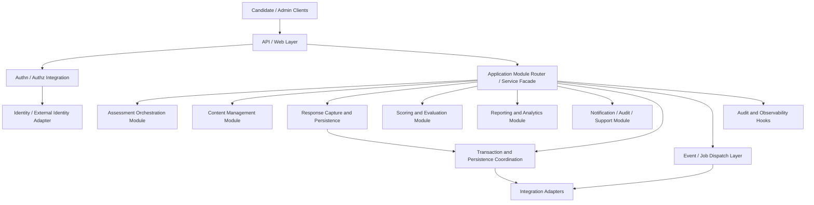
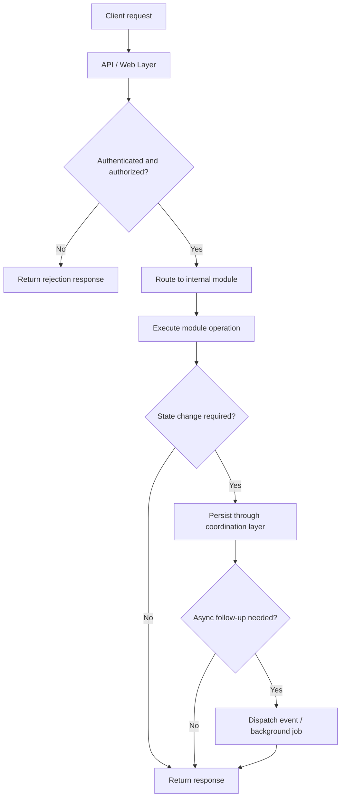
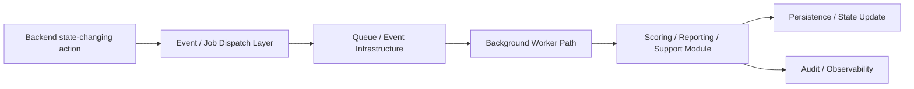

# D-ARCHIE Backend High-Level Design (HLD)

## 1. Document Overview

### 1.1 Purpose
This document defines the high-level design for the `Backend` component of D-ARCHIE.

The purpose of this HLD is to describe the modular monolith backend application that:
- hosts the D-ARCHIE platform API,
- composes the major internal platform modules,
- manages request lifecycle and backend coordination,
- provides shared technical capabilities,
- integrates persistence and asynchronous processing,
- includes Response Capture and Persistence as part of MVP backend scope.

This HLD clarifies how the backend serves as the application shell of the platform without taking ownership of business logic that belongs to orchestration, content, scoring, reporting, or identity components.

### 1.2 Audience
This document is written for:
- solution architects,
- backend engineers,
- platform engineers,
- DevOps / infrastructure engineers,
- product and engineering leads,
- future LLD authors,
- component owners integrating with the backend application shell.

### 1.3 Relationship to Parent Documents
This component HLD is derived from:
- [`BRD.md`](/Users/varshasingh/Desktop/code_practise/PORTFOLIO/DARCHIE/docs/BRD.md)
- [`Platform-HLD.md`](/Users/varshasingh/Desktop/code_practise/PORTFOLIO/DARCHIE/docs/Platform-HLD.md)
- [`Component-HLD-Blueprint.md`](/Users/varshasingh/Desktop/code_practise/PORTFOLIO/DARCHIE/docs/Component-HLD-Blueprint.md)
- [`Assessment-Orchestration-HLD.md`](/Users/varshasingh/Desktop/code_practise/PORTFOLIO/DARCHIE/docs/Assessment-Orchestration-HLD.md)

The platform HLD establishes D-ARCHIE as a modular monolith with one platform API surface. The Assessment Orchestration HLD already defines workflow ownership. This document defines the backend application shell that hosts and coordinates internal modules while respecting those ownership boundaries.

### 1.4 Scope
This HLD covers:
- backend application responsibilities,
- backend module composition and hosting boundaries,
- API/web layer responsibilities,
- request routing and coordination,
- shared backend services,
- persistence and event integration patterns,
- Response Capture and Persistence in MVP scope,
- quality attributes and backend operational concerns,
- handoff points for LLD.

This HLD does not cover:
- detailed frontend behavior,
- orchestration rules or progression logic,
- scoring algorithm design,
- reporting model design,
- content authoring policy design,
- detailed identity policy design,
- endpoint-level API contracts,
- schema-level database design,
- infrastructure-as-code detail,
- exact framework selection.

## 2. Component Summary

### 2.1 Component Name
`Backend`

### 2.2 Mission Statement
The Backend is the modular monolith application layer that exposes the D-ARCHIE platform API and coordinates the internal component modules required to run the platform.

### 2.3 Why This Component Matters
The backend is the operational backbone of D-ARCHIE. It provides the runtime entrypoint for both candidate and admin traffic and ensures that requests are:
- authenticated and authorized,
- routed to the correct module,
- persisted correctly where needed,
- coordinated across storage and event boundaries,
- observable and auditable,
- ready to trigger asynchronous work.

Without this component, the platform modules would exist conceptually but would not have a coherent runtime host or consistent interaction model.

### 2.4 Role in the Platform
The backend acts as:
- the single API surface for the MVP,
- the container for platform modules,
- the coordinator of request lifecycle,
- the integration layer to storage, cache, queues, and external identity,
- the owner of technical composition and shared backend capabilities.

It is not the owner of domain-specific business policy for orchestration, content, scoring, reporting, or identity.

## 3. Goals and Responsibilities

### 3.1 Primary Goals
- provide one coherent backend entrypoint for candidate and admin use cases,
- host the modular monolith with clean internal module boundaries,
- keep cross-cutting technical concerns centralized and consistent,
- support both synchronous interactions and asynchronous job/event initiation,
- make request handling, persistence access, and operational monitoring predictable,
- enable future module extraction without requiring backend redesign from scratch.

### 3.2 Primary Responsibilities
- expose the platform API and backend web layer,
- authenticate and authorize inbound requests through integration with the identity component,
- route requests to internal modules,
- coordinate transactional request handling,
- host Response Capture and Persistence in MVP,
- manage backend-facing persistence integration patterns,
- publish events and initiate background work,
- provide validation, audit, and observability hooks,
- handle backend-level errors and return appropriate response outcomes,
- connect the application layer to storage, cache, queue, and identity integrations.

### 3.3 Explicitly Not Owned by This Component
- workflow policy and progression decisions,
- scoring semantics or evaluation rules,
- content authoring and publishing policy,
- reporting interpretation logic,
- frontend interaction behavior,
- recruiter review workflow rules,
- cloud deployment implementation detail,
- detailed schemas or endpoint contracts at HLD level.

## 4. In Scope / Out of Scope

### 4.1 In Scope for MVP
- single backend API surface,
- candidate and admin request handling,
- modular monolith application composition,
- internal routing to domain modules,
- request authentication and authorization enforcement integration,
- request validation and backend error handling,
- transaction and persistence coordination,
- Response Capture and Persistence as a backend runtime capability,
- object storage integration for response-related artifacts,
- event and job dispatch initiation,
- audit logging and observability integration,
- support for both synchronous and asynchronous backend execution patterns.

### 4.2 Out of Scope for MVP
- separate candidate/admin deployables,
- microservices decomposition,
- endpoint-level API definition,
- database schema detail,
- direct ownership of orchestration rules,
- direct ownership of scoring policy,
- direct ownership of content authoring rules,
- backend-driven adaptive assessment logic,
- infrastructure automation detail.

### 4.3 Deferred to Later Phases
- finer-grained API domain partitioning if scale requires it,
- extraction of modules into separate services,
- dedicated Response Capture and Persistence HLD if later needed,
- advanced operational workflows such as replay, bulk recovery, or tenant-specific routing,
- code-runner and AI integrations as separate backend extensions.

## 5. Actors and Interactions

### 5.1 User Actors
- Candidate
- Recruiter
- Hiring Manager
- Admin / Assessment Designer
- Reviewer

### 5.2 Internal Platform Actors
- Identity and Access
- Assessment Orchestration
- Assessment Content Management
- Response Capture and Persistence
- Scoring and Evaluation
- Reporting and Analytics
- Notification / Audit / Support Services

### 5.3 External / Supporting Systems
- relational operational store,
- object storage,
- cache layer,
- queue / event infrastructure,
- observability stack,
- external identity provider,
- future coding sandbox,
- future AI-assisted evaluation provider.

### 5.4 Interaction Model Summary
- clients interact with the backend through one API surface,
- the backend authenticates and authorizes requests before invoking internal modules,
- internal modules execute domain-specific logic inside the backend application boundary,
- the backend coordinates persistence and event publication,
- asynchronous jobs are triggered through queue/event infrastructure rather than blocking request paths,
- external providers are accessed through integration adapters, not directly from clients.

## 6. Component Boundaries and Dependencies

### 6.1 Boundary Definition
The backend begins when an external request or platform event enters the application and ends when the request outcome, state change, or dispatched async work has been handled at the application-shell level.

The backend owns:
- API entrypoints,
- request lifecycle control,
- module hosting and composition,
- shared technical services,
- persistence access patterns,
- backend error handling,
- event/job initiation,
- operational instrumentation.

The backend does not own:
- domain rules that belong to internal business modules,
- external UI concerns,
- infrastructure provisioning detail.

### 6.2 Upstream Dependencies
Upstream callers include:
- candidate client applications,
- recruiter/admin/reviewer client applications,
- scheduled or background triggers,
- internal event consumers that re-enter backend processing paths.

### 6.3 Downstream Dependencies
The backend depends on:
- Identity and Access for authn/authz decisions,
- Assessment Orchestration for workflow decisions,
- Assessment Content Management for content retrieval and authoring operations,
- Response Capture and Persistence for draft/final response handling,
- Scoring and Evaluation for evaluation-related operations,
- Reporting and Analytics for report generation and retrieval,
- Notification / Audit / Support services for cross-cutting operational outputs,
- relational storage, object storage, cache, queue/event infrastructure, and external identity services.

### 6.4 Synchronous Interactions
- client request authentication,
- request authorization,
- request validation,
- orchestration/content/response/scoring/reporting module invocation,
- persistence writes required within request lifecycle,
- immediate read/query responses.

### 6.5 Asynchronous Interactions
- submission-triggered scoring job initiation,
- report generation triggers,
- notification/event publication,
- audit fan-out,
- expiry or scheduled workflow processing,
- future integration triggers for AI or code execution.

### 6.6 Critical Dependency Rules
- the backend must not replace ownership of internal module business logic,
- the backend must preserve a single API surface while allowing logical separation by use case and role,
- Response Capture and Persistence belongs to backend runtime scope for MVP but does not override orchestration’s ownership of workflow state,
- authn/authz enforcement occurs at backend boundaries but policy ownership remains with the identity component,
- async processing must be initiated by backend but may be fulfilled by background workers using the same modular application boundary.

## 7. Internal Logical Decomposition

The backend should be logically organized into the following capability areas.

### 7.1 API / Web Layer
Responsible for:
- exposing the platform API,
- handling request/response lifecycle,
- mapping role/use-case traffic into backend module invocations,
- standardizing response semantics and error envelopes at architecture level.

### 7.2 Request Authentication and Authorization Integration
Responsible for:
- identity verification handoff,
- request-level access checks,
- session/user context injection into backend processing,
- coordination with identity and access policies.

### 7.3 Application Module Router / Service Facade
Responsible for:
- directing incoming requests to the correct internal module,
- preserving logical boundaries inside one application,
- exposing a consistent application-layer interaction pattern.

### 7.4 Transaction and Persistence Coordination
Responsible for:
- coordinating request-scoped persistence behavior,
- separating transactional and non-transactional work,
- managing consistent access to relational and object-backed storage paths,
- ensuring request lifecycle integrity.

### 7.5 Response Capture and Persistence
Responsible for:
- draft and final response persistence,
- structured response storage integration,
- attachment and artifact linking,
- checkpointing response-related runtime data in backend scope.

This capability remains distinct from orchestration ownership of workflow state.

### 7.6 Event / Job Dispatch Layer
Responsible for:
- triggering background scoring/reporting/notification work,
- publishing domain and operational events,
- separating interactive request latency from longer-running tasks.

### 7.7 Audit and Observability Hooks
Responsible for:
- audit event capture,
- structured logging,
- metrics and tracing hooks,
- backend operational diagnostics.

### 7.8 Integration Adapters
Responsible for backend-facing integration with:
- relational storage,
- object storage,
- cache,
- queue/event infrastructure,
- external identity providers,
- future code-runner and AI integrations.

### 7.9 Internal Logical Decomposition Diagram

## 8. Runtime Flows

### 8.1 Candidate Request Flow

Flow:
1. Candidate sends a request to the backend API.
2. API / Web Layer receives and normalizes the request.
3. Authentication and authorization integration validates access context.
4. Application Module Router determines the correct module path.
5. Request is forwarded to the relevant module, such as:
   - orchestration for session/progression,
   - content for assessment/task retrieval,
   - response persistence for draft/submission handling.
6. Transaction and persistence coordination is applied if the request changes state.
7. Required events or background jobs are initiated.
8. Backend returns the response to the client.

### 8.2 Admin Request Flow

Flow:
1. Recruiter/admin/reviewer sends a request to the backend API.
2. Backend authenticates and authorizes the actor role.
3. Router forwards the request to the relevant internal module, such as:
   - content management for assessment administration,
   - orchestration for session assignment/start state,
   - reporting for candidate result access.
4. Backend coordinates persistence or async work if needed.
5. Backend returns a role-appropriate response.

### 8.3 Response Submission Flow

Flow:
1. Candidate submits a draft or final response.
2. Backend validates request authenticity and request shape.
3. Router directs the request to Response Capture and Persistence.
4. Response data and any associated artifacts are persisted through storage adapters.
5. Backend publishes or triggers downstream work such as:
   - orchestration progression update,
   - scoring initiation,
   - audit event generation.
6. Backend returns a submission acknowledgment or final submission outcome.

### 8.4 Async Scoring / Report / Notification Trigger Flow

Flow:
1. A backend action produces work that should not block the request path.
2. Event / Job Dispatch Layer publishes a background trigger.
3. The appropriate module or worker path processes the work asynchronously.
4. Resulting state updates are persisted and operational events are emitted.
5. Backend-observable status is available for later retrieval or downstream handling.

### 8.5 Error and Authorization Rejection Flow

Flow:
1. A request arrives at the backend boundary.
2. Authentication, authorization, or validation fails, or a module error occurs.
3. Backend applies standardized error handling behavior.
4. Appropriate audit/logging/trace information is recorded.
5. A safe, role-appropriate error response is returned.

### 8.6 Primary Request Flow Diagram

### 8.7 Optional Async Flow Diagram

## 9. High-Level Interfaces and Contracts

This section defines backend-facing architectural contracts, not detailed APIs.

### 9.1 Interfaces Provided by Backend

#### Client -> Backend API
High-level operations:
- candidate session, task, progress, and submission interactions,
- admin assignment and assessment-management interactions,
- reviewer/admin result and report retrieval interactions,
- authentication and access-controlled platform entry.

Interaction type:
- synchronous request/response.

#### Background / Scheduled Triggers -> Backend
High-level operations:
- scheduled expiry checks,
- background job processing,
- event re-entry for async completion handling.

Interaction type:
- asynchronous and scheduled.

### 9.2 Interfaces Consumed by Backend

#### Backend -> Identity and Access
High-level operations:
- authenticate request identity,
- authorize role-based access,
- retrieve user/session access context.

Interaction type:
- synchronous request/response.

#### Backend -> Assessment Orchestration
High-level operations:
- create and manage session-facing workflow actions,
- resolve current progression state,
- update workflow state after backend-triggered events.

Interaction type:
- synchronous plus event-triggered follow-up.

#### Backend -> Assessment Content Management
High-level operations:
- retrieve assessment/task definitions for runtime delivery,
- support admin content operations through hosted application routes.

Interaction type:
- synchronous request/response.

#### Backend -> Response Capture and Persistence
High-level operations:
- create drafts,
- submit final responses,
- retrieve response-linked state,
- store artifacts and checkpoint data.

Interaction type:
- synchronous writes/reads, with event-triggered follow-up.

#### Backend -> Scoring and Evaluation
High-level operations:
- trigger evaluation-related work,
- query score or review readiness,
- consume evaluation-related state changes where needed.

Interaction type:
- synchronous status reads plus asynchronous triggers.

#### Backend -> Reporting and Analytics
High-level operations:
- request report retrieval,
- trigger report generation or refresh where required.

Interaction type:
- synchronous retrieval plus asynchronous generation triggers.

#### Backend -> Storage / Infra Boundaries
High-level operations:
- read/write operational records,
- read/write object-backed artifacts,
- use cache for short-lived access acceleration,
- publish/consume queue or event messages,
- write operational telemetry.

Interaction type:
- mixed synchronous and asynchronous integration.

### 9.3 Events Emitted or Consumed

Events emitted:
- `response_submitted`
- `scoring_requested`
- `report_generation_requested`
- `notification_requested`
- `session_completed`
- `session_expired`

Events consumed:
- `score_completed`
- `review_completed`
- `report_generated`
- `notification_delivered`
- `scheduled_expiry_triggered`

## 10. Domain Concepts and Data Ownership

### 10.1 Platform Concepts Owned by Backend
The backend is not the primary business owner of most domain concepts, but it is the application-shell owner of:
- request lifecycle context,
- backend integration and technical coordination,
- response persistence mechanics in MVP,
- backend-level operational records and technical events.

### 10.2 Platform Concepts Hosted or Coordinated
The backend hosts or coordinates access to:
- `User`
- `Role`
- `Assessment`
- `Assessment Version`
- `Session`
- `Response`
- `Score`
- `Review`
- `Result Summary`

Business ownership of these concepts remains with their respective modules.

### 10.3 Platform Concepts with Direct Backend Runtime Ownership
For MVP, backend directly owns the mechanics of persisting:
- `Response` drafts,
- `Response` final submissions,
- artifact linkage and storage handoff,
- backend-level request and event audit markers.

The backend does not own:
- orchestration state semantics,
- score semantics,
- report semantics,
- assessment content semantics.

### 10.4 System-of-Record Responsibilities
Backend is system-of-record for:
- technical request handling records,
- backend operational event markers,
- response persistence mechanics and stored response records in MVP runtime scope.

Backend is not system-of-record for:
- workflow state semantics,
- published assessment content definitions,
- final score ownership,
- reporting interpretations,
- access policy semantics.

### 10.5 Persistence Responsibilities
The backend writes or coordinates writes to:
- relational operational storage,
- object storage,
- cache where appropriate,
- queue/event infrastructure,
- audit/observability sinks.

### 10.6 Records / Artifacts Produced
- API request outcomes,
- persisted response drafts and final submissions,
- response artifact references,
- backend-generated async work requests,
- audit markers,
- operational telemetry and traces.

## 11. Security, Reliability, Scalability, and Observability

### 11.1 Security
- backend must enforce authentication and authorization before protected operations,
- backend must isolate candidate, recruiter, reviewer, and admin access paths logically,
- backend must not leak cross-role data through shared API handling,
- sensitive writes and privileged actions should be auditable.

### 11.2 Reliability
- backend request handling must be durable for state-changing flows,
- response persistence must be resilient to retries and transient failures,
- async dispatch should not cause duplicate side effects without guardrails,
- module failures should be surfaced cleanly and logged consistently.

### 11.3 Scalability
- a single API surface must still support distinct candidate and admin traffic patterns,
- synchronous user-facing operations should stay lightweight,
- asynchronous workloads should be offloaded from request paths,
- module boundaries should allow future service extraction if scale or team structure changes.

### 11.4 Observability
- backend should trace request path from API entry to module invocation,
- logs should capture auth failures, validation failures, persistence failures, and async dispatch issues,
- metrics should monitor latency, throughput, errors, queue/job volume, and persistence health,
- audit hooks should record privileged and state-changing actions.

## 12. Risks and Failure Considerations

### 12.1 Likely Failure Modes
- unclear ownership between backend shell and business modules,
- response submission success but downstream event dispatch failure,
- authz checks applied inconsistently across candidate and admin flows,
- persistence coordination errors across relational and object-backed storage,
- async job backlog creating delayed user-visible outcomes.

### 12.2 Architectural Risks
- backend may become a catch-all component if module boundaries are not enforced,
- including Response Capture in backend scope may blur ownership if not documented clearly,
- single API surface could become difficult to reason about if use-case separation is not explicit,
- excessive shared-service logic could accidentally duplicate domain logic.

### 12.3 Mitigation Direction
- document module ownership and routing boundaries clearly,
- keep domain logic inside the relevant internal module,
- separate request coordination from business rule execution,
- define response persistence ownership carefully in LLD,
- keep async trigger contracts explicit.

## 13. Deferred Decisions for LLD

The following decisions are intentionally deferred to LLD:
- exact endpoint definitions,
- API grouping and route structure,
- request/response shapes,
- backend framework choice,
- persistence schema design,
- artifact storage key strategy,
- event payload structures,
- transaction boundary detail,
- error envelope detail,
- auth middleware/interceptor mechanics,
- worker process model,
- cache strategy detail.

## 14. Handoff to LLD

The LLD for Backend should define:
- API route grouping and access boundaries,
- application module composition pattern,
- request context model,
- authentication and authorization enforcement points,
- persistence adapter structure,
- response persistence schema and artifact linkage flow,
- event/job dispatch contracts,
- transaction handling model,
- error handling strategy,
- audit and observability implementation hooks,
- worker/runtime execution boundaries.

## 15. Acceptance Checklist

This HLD is acceptable if:
- backend ownership is clearly differentiated from orchestration, content, scoring, reporting, and identity,
- single API surface design is clear without implying a single undifferentiated code path,
- Response Capture and Persistence is visibly included in backend scope for MVP,
- request, persistence, and async dispatch flows are traceable,
- backend-level authn/authz enforcement points are visible,
- storage and event integration boundaries are clear,
- deferred decisions are explicit enough to enable LLD work.

## 16. Future Extension Points

### 16.1 Service Extraction
If scale or team ownership later requires it, backend-hosted modules may be extracted into separate services while keeping the API boundary stable.

### 16.2 Dedicated Response Persistence Component
If response complexity grows significantly, Response Capture and Persistence may later receive its own dedicated component HLD and service boundary.

### 16.3 Additional Integration Adapters
Future adapters may be added for:
- coding runner integration,
- AI-assisted evaluation triggers,
- enterprise export/integration flows.

## 17. Executive Summary

The D-ARCHIE Backend is the modular monolith application shell that exposes a single platform API surface and hosts the platform’s internal modules. It owns request lifecycle control, module composition, persistence integration, async dispatch initiation, and shared technical services.

For MVP, it also includes Response Capture and Persistence as a backend runtime capability. However, it does not take ownership of orchestration workflow logic, content semantics, scoring logic, reporting semantics, or identity policy.

This HLD defines the backend as the runtime host that makes D-ARCHIE operational while preserving clean module ownership for the rest of the platform.
