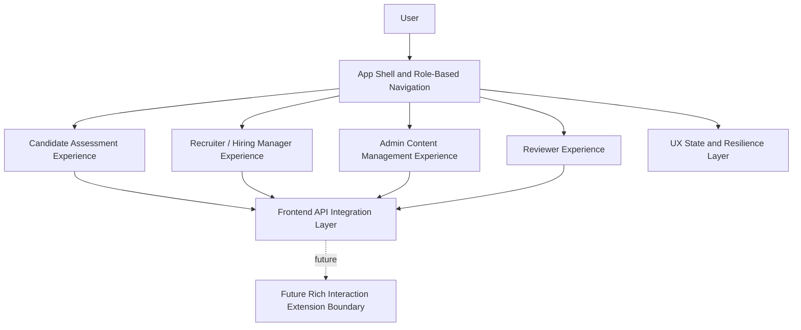
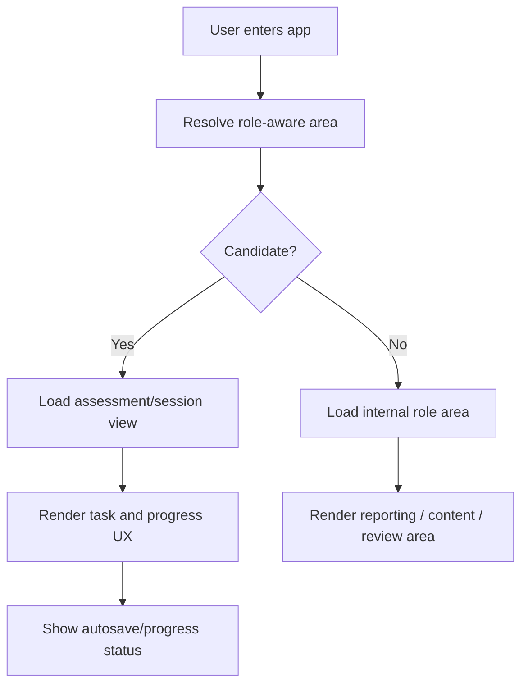
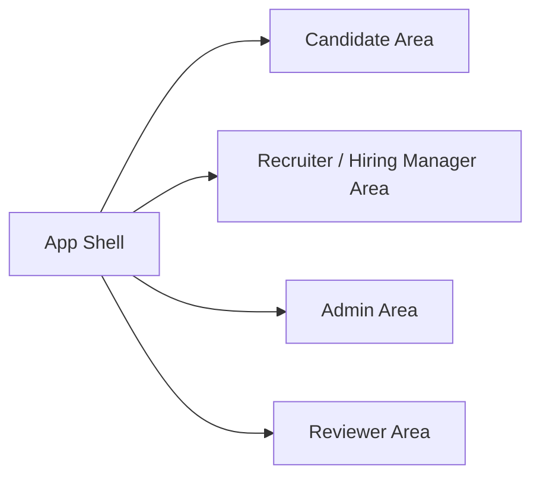

# D-ARCHIE Frontend High-Level Design (HLD)

## 1. Document Overview

### 1.1 Purpose
This document defines the high-level design for the `Frontend` component in D-ARCHIE.

The purpose of this HLD is to define the single shared web application that:
- provides role-based experiences for all key user types,
- prioritizes candidate assessment-taking workflows for MVP,
- supports recruiter and hiring-manager reporting access,
- supports admin content-management access,
- supports reviewer evaluation/review workflows,
- integrates with the backend API while keeping business logic ownership outside the frontend.

This HLD establishes the frontend as the presentation and interaction layer of D-ARCHIE while keeping workflow, scoring, content, reporting, and identity policy ownership outside its boundary.

### 1.2 Audience
This document is written for:
- solution architects,
- frontend engineers,
- backend engineers integrating frontend-facing APIs,
- product and engineering leads,
- UX and design collaborators,
- future LLD authors.

### 1.3 Relationship to Parent Documents
This component HLD is derived from:
- [`BRD.md`](/Users/varshasingh/Desktop/code_practise/PORTFOLIO/DARCHIE/docs/BRD.md)
- [`Platform-HLD.md`](/Users/varshasingh/Desktop/code_practise/PORTFOLIO/DARCHIE/docs/Platform-HLD.md)
- [`Component-HLD-Blueprint.md`](/Users/varshasingh/Desktop/code_practise/PORTFOLIO/DARCHIE/docs/Component-HLD-Blueprint.md)
- [`Backend-HLD.md`](/Users/varshasingh/Desktop/code_practise/PORTFOLIO/DARCHIE/docs/Backend-HLD.md)
- [`Identity-and-Access-HLD.md`](/Users/varshasingh/Desktop/code_practise/PORTFOLIO/DARCHIE/docs/Identity-and-Access-HLD.md)
- [`Assessment-Orchestration-HLD.md`](/Users/varshasingh/Desktop/code_practise/PORTFOLIO/DARCHIE/docs/Assessment-Orchestration-HLD.md)
- [`Assessment-Content-Management-HLD.md`](/Users/varshasingh/Desktop/code_practise/PORTFOLIO/DARCHIE/docs/Assessment-Content-Management-HLD.md)
- [`Scoring-and-Evaluation-HLD.md`](/Users/varshasingh/Desktop/code_practise/PORTFOLIO/DARCHIE/docs/Scoring-and-Evaluation-HLD.md)
- [`Reporting-and-Analytics-HLD.md`](/Users/varshasingh/Desktop/code_practise/PORTFOLIO/DARCHIE/docs/Reporting-and-Analytics-HLD.md)

The platform HLD defines a candidate-facing and recruiter/admin-facing frontend capability. The backend HLD defines a single API surface. The identity HLD defines role-aware access context. This document defines the frontend as one shared web application with role-based areas.

### 1.4 Scope
This HLD covers:
- frontend ownership and boundaries,
- one-app role-based frontend structure,
- candidate-first MVP interaction priorities,
- role-based navigation and experience areas,
- frontend integration with backend APIs,
- high-level interaction flows for candidate, recruiter, hiring manager, admin, and reviewer roles,
- quality attributes and failure considerations,
- handoff points for LLD.

This HLD does not cover:
- backend business logic,
- workflow decision ownership,
- scoring or reporting business semantics,
- identity policy ownership,
- detailed UI screen design,
- component-level frontend code structure,
- endpoint-level API contracts.

## 2. Component Summary

### 2.1 Component Name
`Frontend`

### 2.2 Mission Statement
The Frontend is the single shared web application of D-ARCHIE, responsible for delivering role-appropriate user experiences for assessment-taking, result consumption, content administration, and review workflows.

### 2.3 Why This Component Matters
D-ARCHIE depends on a realistic candidate experience and usable internal workflows. The frontend must:
- provide a strong candidate assessment experience,
- keep role-based areas clear and secure,
- support recruiter/hiring-manager insight consumption,
- support admin content authoring workflows,
- support reviewer scoring/review actions,
- integrate with the backend without absorbing platform business logic.

Without a coherent frontend architecture, the platform would feel fragmented across roles and would risk leaking workflow or scoring logic into the UI layer.

### 2.4 Role in the Platform
The frontend acts as:
- the interaction and presentation layer,
- the single web app shell for all roles,
- the coordinator of role-based navigation and client-side experience boundaries,
- the consumer of backend APIs and access context.

It is not the owner of business rules for workflow, scoring, content semantics, identity policy, or reporting generation.

## 3. Goals and Responsibilities

### 3.1 Primary Goals
- deliver a candidate-first MVP user experience,
- provide one coherent role-based web application rather than multiple separate products,
- keep UI concerns separate from backend business logic,
- support autosave, progress visibility, and assessment continuity at a UX level,
- support internal user workflows without compromising candidate flow quality,
- remain extensible for richer interactions in future phases.

### 3.2 Primary Responsibilities
- render role-based areas for:
  - candidate,
  - recruiter,
  - hiring manager,
  - admin / assessment designer,
  - reviewer,
- support candidate assessment-taking interactions,
- support recruiter/hiring-manager result-viewing interactions,
- support admin content-management access,
- support reviewer score/review interactions,
- manage role-aware navigation and presentation state,
- interact with backend APIs for all user-facing operations,
- present progress, status, and error states clearly,
- support autosave and recovery UX through backend-integrated patterns.

### 3.3 Explicitly Not Owned by This Component
- authentication policy semantics,
- authorization policy ownership,
- workflow progression decisions,
- content authoring semantics,
- score generation,
- report-generation logic,
- persistence ownership,
- advanced visual diagramming/tooling as active MVP behavior.

## 4. In Scope / Out of Scope

### 4.1 In Scope for MVP
- one shared web app,
- role-based areas for candidate, recruiter, hiring manager, admin, and reviewer,
- candidate assessment-taking flows,
- coding-task, structured-response, and scenario-task interaction shells,
- progress display and autosave-oriented UX,
- report viewing for recruiter/hiring manager,
- content-management access paths for admins,
- review/action access paths for reviewers,
- explicit extension boundaries for richer future interactions.

### 4.2 Out of Scope for MVP
- separate frontend products,
- frontend-owned workflow decisions,
- frontend-owned access-policy decisions,
- heavy visual design tooling as a required MVP capability,
- advanced interactive architecture-diagram editors as active MVP behavior,
- endpoint/schema-level API definition,
- detailed screen inventory.

### 4.3 Deferred to Later Phases
- richer visual design/diagramming tools,
- collaborative editing experiences,
- more advanced internal dashboards,
- richer offline/resume behavior,
- more advanced adaptive or AI-assisted user interactions.

## 5. Actors and Interactions

### 5.1 User Actors
- Candidate
- Recruiter
- Hiring Manager
- Admin / Assessment Designer
- Reviewer

### 5.2 Internal Platform Actors
- Backend application shell
- Identity and Access
- Assessment Orchestration
- Assessment Content Management
- Scoring and Evaluation
- Reporting and Analytics

### 5.3 External / Supporting Systems
- browser/client runtime,
- observability/error monitoring tooling,
- future richer interaction modules such as diagramming or advanced editors.

### 5.4 Interaction Model Summary
- frontend is the only user-facing application surface in MVP,
- backend provides the single API surface consumed by the frontend,
- frontend uses identity/access context to shape role-aware UX,
- candidate interactions are tightly integrated with orchestration and response flows,
- internal-role experiences rely on content, scoring, and reporting outputs through backend mediation.

## 6. Component Boundaries and Dependencies

### 6.1 Boundary Definition
The frontend begins when a user interacts with the web application and ends when the frontend has rendered the appropriate role-aware experience and exchanged the required state with backend services.

It owns:
- presentation,
- user interaction structure,
- role-based navigation,
- client-side experience state,
- UX handling for autosave/progress/error/loading patterns.

It does not own:
- business-rule evaluation,
- workflow progression,
- authentication policy,
- scoring logic,
- reporting generation,
- persistence or data integrity decisions.

### 6.2 Upstream Dependencies
Upstream actors include:
- browser users in different roles,
- identity context passed through authenticated backend-mediated access.

### 6.3 Downstream Dependencies
The frontend depends on:
- backend API,
- identity/access context,
- orchestration-backed task/session APIs,
- content-backed admin authoring APIs,
- scoring/review-backed reviewer APIs,
- reporting-backed result-view APIs.

### 6.4 Synchronous Interactions
- page/area load,
- task retrieval,
- report retrieval,
- content management retrieval,
- review-action submission,
- progress/status fetches.

### 6.5 Asynchronous Interactions
- autosave UX with backend-triggered persistence,
- progress refresh,
- report refresh after backend updates,
- future richer async interaction tooling.

### 6.6 Critical Dependency Rules
- frontend renders role-aware experience but does not own access policy,
- frontend must not own branching or workflow logic,
- frontend must not compute scores or report summaries itself,
- backend remains the single API surface,
- advanced future interaction tooling must stay an explicit extension boundary.

## 7. Internal Logical Decomposition

The frontend should be logically organized into the following capability areas.

### 7.1 App Shell and Role-Based Navigation
Responsible for:
- shared app layout,
- role-aware navigation,
- route or area separation by experience type,
- entry into candidate, recruiter, hiring manager, admin, and reviewer sections.

### 7.2 Candidate Assessment Experience
Responsible for:
- assessment entry,
- task rendering shells,
- coding and structured-response interactions,
- progress display,
- autosave-aware UX,
- candidate-friendly status and continuity behavior.

### 7.3 Recruiter / Hiring Manager Experience
Responsible for:
- candidate result viewing,
- scorecard display,
- component-insight access,
- comparison-view access where provided by backend.

### 7.4 Admin Content Management Experience
Responsible for:
- access to assessment authoring views,
- draft/review/publish lifecycle interaction surfaces,
- content-library access and management entry points.

### 7.5 Reviewer Experience
Responsible for:
- review-task access,
- evaluation/review action surfaces,
- status visibility for review-related work.

### 7.6 Frontend API Integration Layer
Responsible for:
- consuming backend APIs,
- mapping backend responses into frontend state,
- isolating UI from transport and integration concerns.

### 7.7 UX State and Resilience Layer
Responsible for:
- loading/error/empty states,
- autosave indicators,
- progress continuity,
- role-aware session-state presentation.

### 7.8 Future Rich Interaction Extension Boundary
Responsible for:
- preserving room for future richer editors, visual tools, and advanced interactive workflows,
- keeping those capabilities outside MVP core assumptions.

### 7.9 Internal Logical Decomposition Diagram

## 8. Frontend Interaction Flows

### 8.1 Candidate Assessment Flow

Flow:
1. Candidate enters the application.
2. Frontend resolves role-aware entry using backend-provided identity/access context.
3. Candidate Assessment Experience loads the active assessment/session view.
4. Task content is rendered through backend-provided state.
5. Autosave/progress/status UX is maintained as the candidate interacts.

### 8.2 Recruiter / Hiring Manager Reporting Flow

Flow:
1. Recruiter or hiring manager enters the application.
2. Frontend resolves role-aware navigation.
3. Reporting views are requested from backend.
4. Candidate scorecards, component insights, and summary views are displayed.

### 8.3 Admin Content-Management Flow

Flow:
1. Admin accesses content-management area.
2. Frontend presents assessment authoring/navigation areas.
3. Backend-backed content operations are invoked for draft, review, and publish workflows.
4. Frontend reflects content lifecycle state and authoring progress.

### 8.4 Reviewer Flow

Flow:
1. Reviewer accesses review-related area.
2. Frontend loads review-relevant tasks and status.
3. Review actions are submitted through backend.
4. Updated review status is reflected in the reviewer experience.

### 8.5 Primary Candidate-First Flow Diagram

### 8.6 Optional Role-Based Area Flow Diagram

## 9. High-Level Interfaces and Contracts

This section defines frontend-facing architectural contracts, not detailed APIs.

### 9.1 Interfaces Provided by Frontend

#### User -> Frontend
High-level operations:
- access role-based app areas,
- take assessments,
- view reports,
- manage content,
- perform review actions.

Interaction type:
- interactive UI.

### 9.2 Interfaces Consumed by Frontend

#### Frontend -> Backend API
High-level operations:
- authenticate/initiate role-aware app access through backend-mediated identity context,
- retrieve assessment/session/task state,
- submit responses and draft updates,
- retrieve reports,
- retrieve content-management views/actions,
- retrieve and submit review actions.

Interaction type:
- synchronous request/response plus async refresh patterns.

#### Frontend -> Identity and Access Context
High-level operations:
- determine current role-aware experience,
- render allowed navigation and protected views.

Interaction type:
- backend-mediated access context consumption.

### 9.3 Events Emitted or Consumed

Events consumed:
- backend-driven state refreshes where reflected in UI

Events emitted:
- user interaction events relevant to analytics or observability

## 10. Domain Concepts and Data Ownership

### 10.1 Platform Concepts Referenced by Frontend
- `User`
- `Role`
- `Assessment`
- `Assessment Version`
- `Session`
- `Response`
- `Review`
- `Result Summary`

### 10.2 Platform Concepts Owned by Frontend
The frontend does not own core business-domain concepts. It owns:
- UI presentation state,
- navigation state,
- local interaction state,
- role-aware client experience state.

### 10.3 System-of-Record Responsibilities
Frontend is not system-of-record for platform business data.

Frontend is effectively system-of-record only for:
- transient client-side interaction state,
- temporary presentation and navigation state.

### 10.4 Persistence Responsibilities
Frontend may coordinate temporary client-side state handling for UX continuity, but persistent system-of-record ownership remains with backend-hosted modules.

### 10.5 Records / Artifacts Produced
- UI interaction state,
- client-side navigation state,
- user-triggered actions sent to backend,
- frontend observability and telemetry markers where appropriate.

## 11. Security, Reliability, Scalability, and Observability

### 11.1 Security
- frontend must respect role-aware access context,
- protected views should not be exposed without validated backend-mediated identity context,
- sensitive data should only be rendered for authorized roles,
- frontend must not become a source of security-policy truth.

### 11.2 Reliability
- candidate progress UX should remain resilient during long assessment sessions,
- autosave and progress feedback should reduce user uncertainty,
- frontend should handle backend failures gracefully,
- role-based experiences should degrade safely when dependent data is unavailable.

### 11.3 Scalability
- one shared app should support multiple role experiences without becoming an undifferentiated UI,
- candidate-heavy traffic should not compromise internal-role usability,
- richer future interaction modules should be addable without restructuring the entire frontend boundary.

### 11.4 Observability
- trace critical candidate flows,
- monitor frontend errors in assessment-taking experiences,
- monitor latency and failures for report and content-management views,
- record user-facing failure states for support diagnostics.

## 12. Risks and Failure Considerations

### 12.1 Likely Failure Modes
- frontend accidentally absorbing workflow or scoring logic,
- unclear role boundaries in one shared app,
- candidate assessment UX suffering because internal-role complexity dominates architecture,
- stale UI after backend state changes,
- overdesigning rich interaction tooling too early.

### 12.2 Architectural Risks
- a single web app may become hard to reason about if role separation is weak,
- UI complexity may grow quickly across candidate, admin, recruiter, and reviewer experiences,
- autosave/progress UX can become confusing if not clearly aligned with backend-backed state.

### 12.3 Mitigation Direction
- keep frontend responsibilities presentation-oriented,
- prioritize candidate workflow in MVP design,
- use clear role-based area separation,
- keep advanced future interaction tooling behind explicit extension boundaries,
- let backend remain the source of truth for business state.

## 13. Deferred Decisions for LLD

The following decisions are intentionally deferred to LLD:
- exact route structure,
- page/screen inventory,
- component hierarchy,
- client state-management detail,
- autosave UX implementation detail,
- exact API binding contracts,
- visual design system specifics,
- frontend telemetry schema,
- future rich-editor integration approach.

## 14. Handoff to LLD

The LLD for Frontend should define:
- route and role-area structure,
- page and screen map,
- UI state model,
- backend integration contracts,
- autosave/progress interaction behavior,
- access-guard implementation pattern,
- component decomposition,
- error/loading/empty-state behavior,
- frontend observability hooks.

## 15. Acceptance Checklist

This HLD is acceptable if:
- frontend is clearly defined as one shared web app with role-based areas,
- candidate workflow is clearly prioritized for MVP,
- recruiter/hiring-manager, admin, and reviewer experiences are all represented,
- frontend ownership remains presentation-oriented,
- business logic ownership stays in backend, orchestration, content, scoring, reporting, and identity,
- future richer interaction capabilities remain extension boundaries only,
- deferred decisions are explicit enough for LLD work.

## 16. Future Extension Points

### 16.1 Rich Visual / Interactive Tasking
Future versions may add richer diagramming, architecture-design tooling, or other highly interactive task experiences.

Architectural position:
- explicit extension boundary,
- not a required MVP capability.

### 16.2 Broader Internal Workbench Experiences
Future versions may add richer internal workbenches for admins, reviewers, and hiring teams.

### 16.3 Advanced Offline / Resume UX
Future versions may improve resume continuity and resilience for long-running candidate sessions.

## 17. Executive Summary

The D-ARCHIE Frontend is one shared web application with role-based areas for candidates, recruiters, hiring managers, admins, and reviewers. It prioritizes candidate assessment-taking workflows in MVP while still supporting internal-role experiences for reporting, content management, and review.

It owns presentation, interaction, and role-based navigation, but not platform business logic. Backend remains the single API surface, while identity, orchestration, content, scoring, and reporting retain their respective ownership.

This HLD defines the MVP frontend boundary needed to deliver a coherent product experience without blurring the architectural responsibilities already established in the rest of the HLD set.
