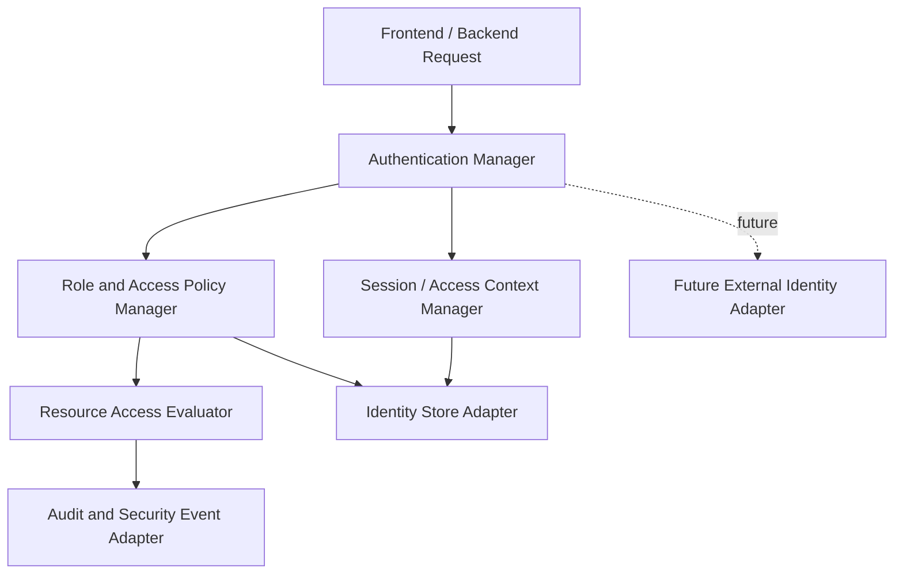
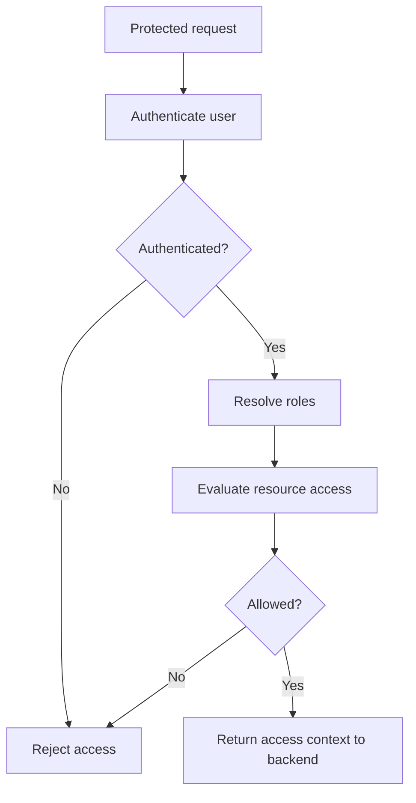
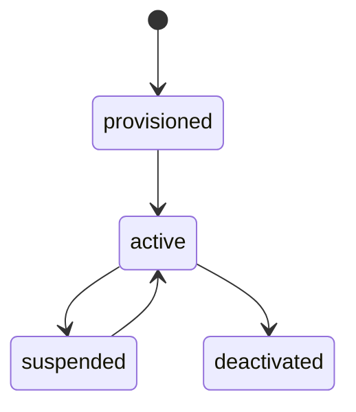

# D-ARCHIE Identity and Access High-Level Design (HLD)

## 1. Document Overview

### 1.1 Purpose
This document defines the high-level design for the `Identity and Access` component in D-ARCHIE.

The purpose of this HLD is to define the module that owns:
- platform-managed authentication,
- role-based authorization,
- session and access context,
- resource-aware access control,
- identity lifecycle for platform users,
- future external SSO and federation extension boundaries.

This HLD establishes Identity and Access as the source of truth for authentication and authorization policy in D-ARCHIE while keeping application hosting, workflow execution, scoring, reporting, and frontend interaction outside its ownership boundary.

### 1.2 Audience
This document is written for:
- solution architects,
- backend engineers,
- platform engineers,
- product and engineering leads,
- future LLD authors,
- engineers working on backend, frontend, orchestration, content, scoring, and reporting integrations.

### 1.3 Relationship to Parent Documents
This component HLD is derived from:
- [`BRD.md`](/Users/varshasingh/Desktop/code_practise/PORTFOLIO/DARCHIE/docs/BRD.md)
- [`Platform-HLD.md`](/Users/varshasingh/Desktop/code_practise/PORTFOLIO/DARCHIE/docs/Platform-HLD.md)
- [`Component-HLD-Blueprint.md`](/Users/varshasingh/Desktop/code_practise/PORTFOLIO/DARCHIE/docs/Component-HLD-Blueprint.md)
- [`Backend-HLD.md`](/Users/varshasingh/Desktop/code_practise/PORTFOLIO/DARCHIE/docs/Backend-HLD.md)
- [`Assessment-Orchestration-HLD.md`](/Users/varshasingh/Desktop/code_practise/PORTFOLIO/DARCHIE/docs/Assessment-Orchestration-HLD.md)
- [`Assessment-Content-Management-HLD.md`](/Users/varshasingh/Desktop/code_practise/PORTFOLIO/DARCHIE/docs/Assessment-Content-Management-HLD.md)
- [`Scoring-and-Evaluation-HLD.md`](/Users/varshasingh/Desktop/code_practise/PORTFOLIO/DARCHIE/docs/Scoring-and-Evaluation-HLD.md)
- [`Reporting-and-Analytics-HLD.md`](/Users/varshasingh/Desktop/code_practise/PORTFOLIO/DARCHIE/docs/Reporting-and-Analytics-HLD.md)

The platform HLD defines Identity and Access as the module responsible for authentication and authorization. The backend HLD already defines that backend enforces authn/authz at request boundaries but does not own policy semantics. This document defines the Identity and Access module itself.

### 1.4 Scope
This HLD covers:
- authentication ownership and boundaries,
- RBAC and resource-aware access control,
- role model and access context,
- identity lifecycle,
- session and token/access state concepts at HLD level,
- interfaces to backend and consuming modules,
- future external SSO/federation extension boundaries,
- quality attributes and failure considerations,
- handoff points for LLD.

This HLD does not cover:
- backend request routing ownership,
- frontend session UX behavior,
- workflow progression logic,
- content, scoring, or reporting business logic,
- endpoint-level auth contracts,
- schema-level identity storage design,
- active external SSO in MVP.

## 2. Component Summary

### 2.1 Component Name
`Identity and Access`

### 2.2 Mission Statement
Identity and Access is the platform security and access-control component of D-ARCHIE, responsible for authenticating users, assigning roles, enforcing access policy, and providing the access context needed by the rest of the platform.

### 2.3 Why This Component Matters
D-ARCHIE supports multiple actor types with different permissions:
- candidates,
- recruiters,
- hiring managers,
- admins / assessment designers,
- reviewers.

The platform needs a dedicated identity component to:
- separate authentication from application logic,
- prevent cross-role data leakage,
- enforce access around assessments, sessions, responses, reviews, and reports,
- support a secure MVP while leaving room for enterprise identity later.

Without this component, each module would risk implementing inconsistent security behavior.

### 2.4 Role in the Platform
Identity and Access acts as:
- the system-of-record for user identity and role assignment in MVP,
- the policy owner for authentication and authorization rules,
- the provider of authenticated user context to the backend and platform modules,
- the future boundary for SSO/federation integration.

It is not the owner of request routing, UI session presentation, workflow progression, or result generation.

## 3. Goals and Responsibilities

### 3.1 Primary Goals
- provide platform-managed authentication for MVP,
- enforce RBAC across all role types,
- support resource-aware authorization where role alone is insufficient,
- centralize access policy ownership,
- keep the architecture ready for future external identity integration,
- make access control auditable and consistent.

### 3.2 Primary Responsibilities
- authenticate users,
- maintain user identity records in MVP,
- assign and resolve roles,
- provide access context to backend request handling,
- enforce authorization over protected resources,
- support access rules across:
  - assessments,
  - assessment versions where relevant,
  - sessions,
  - responses,
  - reviews,
  - result/report access,
  - content authoring and publishing actions,
- manage session/access context lifecycle at HLD level,
- expose future extension points for SSO/federation.

### 3.3 Explicitly Not Owned by This Component
- backend request handling,
- frontend session rendering behavior,
- workflow decisions,
- score generation,
- report generation,
- content authoring semantics,
- external enterprise identity as an active MVP dependency.

## 4. In Scope / Out of Scope

### 4.1 In Scope for MVP
- platform-managed authentication,
- role-based access control,
- resource-aware access checks where needed,
- candidate vs internal-role separation,
- access to assessment sessions and results,
- access control for content authoring/review/publishing,
- access control for score/review operations,
- access context generation for backend requests,
- auditability of sensitive access actions,
- explicit future SSO/federation boundary.

### 4.2 Out of Scope for MVP
- active enterprise SSO,
- federated identity as a required runtime dependency,
- advanced ABAC-only policy models,
- fine-grained external tenant federation,
- endpoint/schema-level identity contracts,
- UI login screen details.

### 4.3 Deferred to Later Phases
- enterprise SSO,
- federation with external identity providers,
- richer policy engines,
- tenant-aware identity features,
- stronger delegated administration patterns.

## 5. Actors and Interactions

### 5.1 User Actors
- Candidate
- Recruiter
- Hiring Manager
- Admin / Assessment Designer
- Reviewer

### 5.2 Internal Platform Actors
- Backend application shell
- Frontend application
- Assessment Orchestration
- Assessment Content Management
- Scoring and Evaluation
- Reporting and Analytics
- Notification / Audit / Support Services

### 5.3 External / Supporting Systems
- identity store,
- session/token store as needed,
- audit/observability stack,
- future external identity provider.

### 5.4 Interaction Model Summary
- frontend and backend rely on Identity and Access to establish user identity and access context,
- backend enforces request-boundary auth using identity-provided context,
- downstream modules rely on role and resource access decisions supplied through backend integration,
- future external identity should integrate through a dedicated boundary rather than changing internal ownership.

## 6. Component Boundaries and Dependencies

### 6.1 Boundary Definition
Identity and Access begins when an identity must be established, a role resolved, or an access decision made, and ends when authenticated context or an authorization outcome has been returned and recorded where necessary.

It owns:
- authentication decisions,
- role resolution,
- access policy semantics,
- resource-aware access checks,
- user identity state in MVP,
- access/session context definitions.

It does not own:
- application request routing,
- UI rendering,
- resource business logic,
- workflow state,
- scoring or reporting semantics.

### 6.2 Upstream Dependencies
Upstream callers include:
- backend request handlers,
- frontend-initiated auth entry flows through backend,
- internal modules requiring access validation.

### 6.3 Downstream Dependencies
Identity and Access depends on:
- identity/user persistence,
- session/token persistence where needed,
- audit/observability infrastructure,
- future optional external identity provider integration.

### 6.4 Synchronous Interactions
- authenticate user,
- resolve user role set,
- authorize action against resource context,
- retrieve access context for current request,
- validate session/access state.

### 6.5 Asynchronous Interactions
- audit event emission,
- role/access change notification where needed,
- future identity sync/federation flows.

### 6.6 Critical Dependency Rules
- backend hosts request enforcement but does not own identity policy,
- frontend consumes session/access outcomes but does not define security policy,
- resource modules define business resources while identity defines who may act on them,
- future SSO must attach at a defined extension boundary without replacing MVP auth semantics abruptly.

## 7. Internal Logical Decomposition

The component should be logically organized into the following capability areas.

### 7.1 Authentication Manager
Responsible for:
- platform-managed login/authentication,
- identity verification,
- authentication outcome generation.

### 7.2 Role and Access Policy Manager
Responsible for:
- role ownership,
- RBAC enforcement,
- mapping roles to access policy behavior,
- resolving role-based permissions.

### 7.3 Resource Access Evaluator
Responsible for:
- resource-aware access checks,
- combining role and resource context,
- enforcing access to sessions, reports, content operations, and review actions.

### 7.4 Session / Access Context Manager
Responsible for:
- current authenticated context resolution,
- session/access lifecycle at HLD level,
- supplying access context for backend processing.

### 7.5 Identity Store Adapter
Responsible for:
- user identity persistence integration,
- role assignment persistence integration,
- access-related record retrieval.

### 7.6 Audit and Security Event Adapter
Responsible for:
- logging sensitive access decisions,
- emitting security/audit markers,
- supporting traceability for privileged actions.

### 7.7 Future External Identity Adapter
Responsible for:
- explicit extension boundary for future SSO/federation,
- keeping external identity outside MVP core flow,
- allowing future enterprise integration.

### 7.8 Internal Logical Decomposition Diagram

## 8. Identity and Access Flows

### 8.1 Authentication Flow

Flow:
1. A user attempts to access the platform.
2. Backend invokes Identity and Access for authentication.
3. Authentication Manager verifies identity using the MVP platform-managed auth model.
4. Session / Access Context Manager establishes authenticated context.
5. Access context is returned to backend for subsequent authorized operations.

### 8.2 Authorization / Access Check Flow

Flow:
1. A protected action is requested.
2. Backend passes user identity, role context, and resource context to Identity and Access.
3. Role and Access Policy Manager resolves role-based permissions.
4. Resource Access Evaluator checks whether the action is allowed against the requested resource.
5. Identity and Access returns allow/deny plus access context needed by the backend.

### 8.3 Resource-Aware Access Example Flow

Flow:
1. A recruiter requests a candidate report or an admin requests content-publish access.
2. Identity and Access resolves role membership.
3. Resource Access Evaluator verifies that the actor is allowed to access the specific report, session, or content operation.
4. Backend continues only if authorization succeeds.

### 8.4 Identity Lifecycle Flow

Flow:
1. A user account exists or is provisioned for platform use.
2. Roles are assigned according to platform responsibilities.
3. The user authenticates and receives an active access context.
4. Subsequent requests reuse or refresh validated access context as needed.
5. Role changes affect future access decisions.

### 8.5 Primary Access-Check Flow Diagram

### 8.6 Optional Identity Lifecycle State Diagram

The exact lifecycle and session-state details are deferred to LLD.

## 9. High-Level Interfaces and Contracts

This section defines identity-facing architectural contracts, not detailed APIs.

### 9.1 Interfaces Provided by Identity and Access

#### Backend -> Identity and Access
High-level operations:
- authenticate user,
- retrieve access context,
- authorize protected action,
- validate role/resource access,
- check session/access state.

Interaction type:
- synchronous request/response.

#### Frontend -> Backend -> Identity and Access
High-level operations:
- initiate login/authenticated session,
- retrieve current-user access context through backend-mediated flows,
- support role-aware app behavior through backend-supplied identity context.

Interaction type:
- synchronous via backend boundary.

### 9.2 Interfaces Consumed by Identity and Access

#### Identity and Access -> Identity / Session Persistence
High-level operations:
- store and retrieve user identities,
- store and retrieve role assignments,
- store and validate access/session state.

Interaction type:
- synchronous persistence.

#### Identity and Access -> Audit / Observability Infrastructure
High-level operations:
- record authentication outcomes,
- record privileged access decisions,
- record security-relevant state changes.

Interaction type:
- synchronous and asynchronous audit/event emission.

#### Identity and Access -> Future External Identity Boundary
High-level operations:
- future SSO/federation handshake,
- future external identity validation,
- future identity-attribute intake.

Interaction type:
- future optional integration only.

### 9.3 Events Emitted or Consumed

Events emitted:
- `user_authenticated`
- `access_denied`
- `role_assignment_changed`
- `session_terminated`

Events consumed:
- optional future identity-sync or federation events

## 10. Domain Concepts and Data Ownership

### 10.1 Platform Concepts Owned by Identity and Access
- `User`
- `Role`

It also owns:
- access context,
- authentication state,
- authorization policy outcomes.

### 10.2 Platform Concepts Referenced but Not Owned
- `Assessment`
- `Assessment Version`
- `Session`
- `Response`
- `Review`
- `Result Summary`

### 10.3 System-of-Record Responsibilities
Identity and Access is system-of-record for:
- user identity records in MVP,
- role assignments,
- authentication/access context state,
- authorization decision policy ownership.

Identity and Access is not system-of-record for:
- workflow state,
- assessment content,
- scoring outputs,
- reporting read models.

### 10.4 Persistence Responsibilities
Identity and Access writes or coordinates writes to:
- identity/user store,
- role-assignment store,
- access/session state store where needed,
- audit/observability channels for security events.

### 10.5 Records / Artifacts Produced
- authenticated user context,
- authorization outcomes,
- role-assignment records,
- security/audit markers,
- access/session state records.

## 11. Security, Reliability, Scalability, and Observability

### 11.1 Security
- access checks must be enforced consistently across all platform roles,
- privileged actions must be auditable,
- resource-level access must prevent cross-user and cross-role leakage,
- future SSO integration must not weaken the platform’s security posture.

### 11.2 Reliability
- authentication and authorization outcomes must be stable and repeatable,
- access-context failures should fail closed rather than open,
- role changes must take effect predictably for future access decisions,
- session/access state should be resilient enough for platform usage patterns.

### 11.3 Scalability
- auth and access checks should remain lightweight for interactive traffic,
- the model should support growth in users, sessions, and protected resources,
- future external identity should plug in without redesigning access ownership.

### 11.4 Observability
- trace authentication attempts,
- monitor access-denied outcomes,
- log privileged access decisions,
- audit role-assignment and security-relevant changes.

## 12. Risks and Failure Considerations

### 12.1 Likely Failure Modes
- inconsistent access enforcement across modules,
- stale access context after role changes,
- overbroad role permissions,
- under-specified resource-level access rules,
- future SSO integration pressure distorting MVP identity design.

### 12.2 Architectural Risks
- backend and identity responsibilities may blur if policy ownership is not documented clearly,
- RBAC alone may be insufficient for some resources unless resource-aware checks are explicit,
- overdesigning enterprise identity too early could slow MVP delivery.

### 12.3 Mitigation Direction
- keep policy ownership inside Identity and Access,
- use RBAC as the core model with resource-aware checks where needed,
- keep future SSO as an explicit extension boundary only,
- define sensitive resource access clearly in LLD.

## 13. Deferred Decisions for LLD

The following decisions are intentionally deferred to LLD:
- exact login/session model,
- token/session storage detail,
- exact permission matrix,
- role hierarchy rules,
- password or credential management mechanics,
- resource-level policy detail,
- audit event schema,
- future federation handshake design,
- exact API shapes.

## 14. Handoff to LLD

The LLD for Identity and Access should define:
- user and role entities,
- permission matrix,
- resource-access rules,
- session/access context model,
- authentication workflow detail,
- authorization decision rules,
- audit event schema,
- persistence schema,
- future SSO integration contract boundary.

## 15. Acceptance Checklist

This HLD is acceptable if:
- identity ownership is clearly separated from backend hosting and frontend UX,
- platform-managed authentication is clearly the MVP posture,
- RBAC and resource-aware access are both visible,
- access coverage across assessments, sessions, responses, reviews, and reports is explicit,
- future SSO/federation is visible only as an extension boundary,
- deferred decisions are explicit enough for LLD work.

## 16. Future Extension Points

### 16.1 External SSO / Federation
Future versions may add:
- enterprise SSO,
- federated identity providers,
- identity sync.

Architectural position:
- explicit extension boundary,
- not active MVP behavior.

### 16.2 Richer Policy Models
Future versions may add stronger policy engines, delegated administration, or tenant-aware access models.

## 17. Executive Summary

Identity and Access is the D-ARCHIE security boundary for authentication and authorization. It owns platform-managed authentication, role-based access control, resource-aware access decisions, and access context generation for backend and frontend consumers.

It does not own request routing, workflow progression, score generation, or report generation. Instead, it provides the trusted identity and policy layer those components rely on.

This HLD defines the MVP identity posture clearly while keeping enterprise SSO and richer policy models as explicit future extensions.
