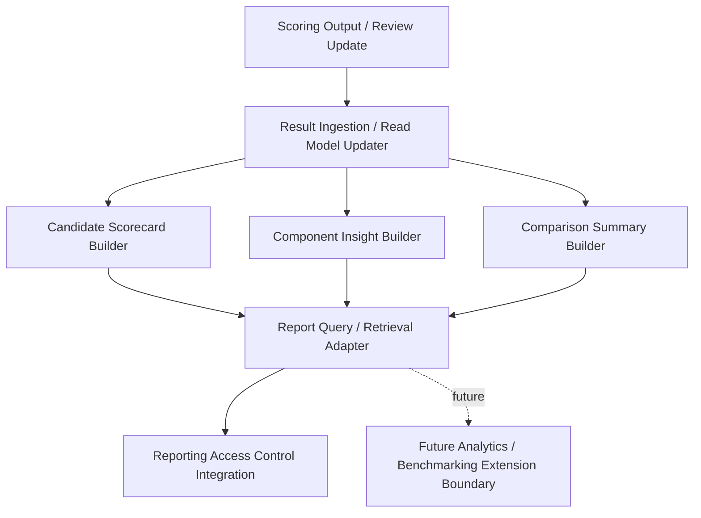
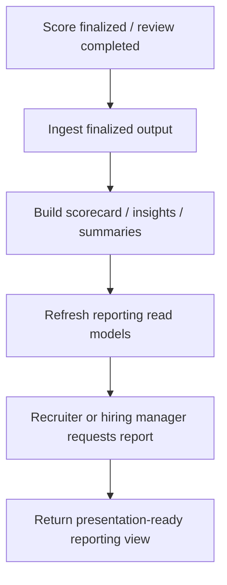
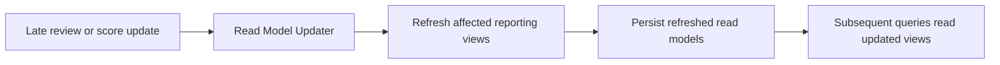

# D-ARCHIE Reporting and Analytics High-Level Design (HLD)

## 1. Document Overview

### 1.1 Purpose
This document defines the high-level design for the `Reporting and Analytics` component in D-ARCHIE.

The purpose of this HLD is to define the module that:
- consumes finalized evaluation outputs,
- builds recruiter- and hiring-manager-facing reporting views,
- produces candidate scorecards,
- presents component-wise strengths and weaknesses,
- provides overall assessment summaries,
- supports basic comparison insights,
- preserves extension boundaries for future analytics and benchmarking.

This HLD establishes Reporting and Analytics as the read-oriented result-consumption and presentation-preparation module of D-ARCHIE while keeping score generation, content ownership, and workflow ownership outside its boundary.

### 1.2 Audience
This document is written for:
- solution architects,
- backend engineers,
- product and engineering leads,
- assessment-platform designers,
- future LLD authors,
- engineers working on scoring, orchestration, backend, recruiter experience, and analytics/reporting use cases.

### 1.3 Relationship to Parent Documents
This component HLD is derived from:
- [`BRD.md`](/Users/varshasingh/Desktop/code_practise/PORTFOLIO/DARCHIE/docs/BRD.md)
- [`Platform-HLD.md`](/Users/varshasingh/Desktop/code_practise/PORTFOLIO/DARCHIE/docs/Platform-HLD.md)
- [`Component-HLD-Blueprint.md`](/Users/varshasingh/Desktop/code_practise/PORTFOLIO/DARCHIE/docs/Component-HLD-Blueprint.md)
- [`Backend-HLD.md`](/Users/varshasingh/Desktop/code_practise/PORTFOLIO/DARCHIE/docs/Backend-HLD.md)
- [`Assessment-Orchestration-HLD.md`](/Users/varshasingh/Desktop/code_practise/PORTFOLIO/DARCHIE/docs/Assessment-Orchestration-HLD.md)
- [`Assessment-Content-Management-HLD.md`](/Users/varshasingh/Desktop/code_practise/PORTFOLIO/DARCHIE/docs/Assessment-Content-Management-HLD.md)
- [`Scoring-and-Evaluation-HLD.md`](/Users/varshasingh/Desktop/code_practise/PORTFOLIO/DARCHIE/docs/Scoring-and-Evaluation-HLD.md)

The platform HLD defines reporting as the module responsible for candidate performance summaries and component-wise insights. The scoring HLD already defines that scoring owns score generation and finalization state. This document defines how Reporting and Analytics consumes finalized outputs and turns them into recruiter-facing and hiring-manager-facing decision-support views.

### 1.4 Scope
This HLD covers:
- reporting ownership and boundaries,
- candidate scorecard generation,
- component insight generation,
- overall assessment summary generation,
- basic comparison capability,
- read-model construction and refresh,
- interfaces to backend, scoring, and content,
- quality attributes and failure considerations,
- handoff points for LLD.

This HLD does not cover:
- score generation,
- rubric definition ownership,
- runtime workflow progression,
- candidate response storage,
- advanced benchmarking or cohort analytics in MVP,
- endpoint-level APIs,
- report UI implementation detail,
- schema-level storage design.

## 2. Component Summary

### 2.1 Component Name
`Reporting and Analytics`

### 2.2 Mission Statement
Reporting and Analytics is the result-consumption and insight-delivery module of D-ARCHIE, responsible for turning finalized scoring outputs into recruiter- and hiring-manager-facing scorecards, summaries, and basic comparison views.

### 2.3 Why This Component Matters
D-ARCHIE creates value only if hiring teams can interpret assessment outcomes clearly. The platform needs a reporting module that can:
- present candidate performance across all relevant components,
- surface strengths and weaknesses in a useful decision-support format,
- summarize overall assessment performance,
- support simple comparisons without requiring raw score interpretation,
- remain consistent with finalized scoring state.

Without this component, the platform would generate scores but not the actionable reporting layer needed by recruiters and hiring managers.

### 2.4 Role in the Platform
Reporting and Analytics acts as:
- the system-of-record for reporting read models and presentation-ready result views,
- the consumer of finalized score and review outputs,
- the producer of candidate scorecards and comparison-ready summaries,
- the read-oriented insight layer for hiring decision support.

It is not the owner of score semantics, workflow progression, authored content, or response data.

## 3. Goals and Responsibilities

### 3.1 Primary Goals
- optimize MVP reporting for recruiter and hiring-manager decision support,
- provide clear candidate-level scorecards,
- surface component-level strengths and weaknesses,
- support basic comparisons without overbuilding analytics,
- separate reporting read models from scoring ownership,
- preserve future extension points for richer analytics and benchmarking.

### 3.2 Primary Responsibilities
- consume finalized score and review outputs,
- build candidate-level scorecards,
- produce component-wise insight views,
- generate overall assessment summaries,
- support basic comparison summaries across components and candidates,
- maintain reporting read models for query-friendly retrieval,
- refresh reporting views when finalized score or review changes occur,
- expose presentation-ready result data to backend and consuming clients.

### 3.3 Explicitly Not Owned by This Component
- score generation,
- rubric definition ownership,
- workflow progression decisions,
- candidate response persistence,
- advanced benchmarking or cohort analytics in MVP,
- recruiter-facing UI rendering behavior,
- endpoint-level reporting contract detail at HLD level.

## 4. In Scope / Out of Scope

### 4.1 In Scope for MVP
- candidate scorecards,
- component strengths and weaknesses summaries,
- overall assessment summaries,
- basic candidate/component comparison summaries,
- read-model generation and refresh,
- recruiter and hiring-manager access-oriented result views,
- refresh behavior when finalized score state changes,
- explicit future analytics extension boundaries.

### 4.2 Out of Scope for MVP
- score generation,
- full benchmarking,
- advanced cohort analytics,
- operational BI or broad platform analytics,
- candidate workflow ownership,
- candidate response storage ownership,
- endpoint/schema-level contracts.

### 4.3 Deferred to Later Phases
- benchmarking across cohorts,
- richer aggregate and trend analytics,
- broader admin/ops analytics,
- predictive hiring indicators,
- advanced analytics export and benchmarking features.

## 5. Actors and Interactions

### 5.1 User Actors
- Recruiter
- Hiring Manager
- Admin in limited report-access contexts

### 5.2 Internal Platform Actors
- Backend application shell
- Scoring and Evaluation
- Assessment Content Management
- Identity and Access
- Notification / Audit / Support Services

### 5.3 External / Supporting Systems
- reporting read store or read-optimized persistence boundary,
- relational operational store as needed,
- cache for result retrieval acceleration,
- observability stack,
- future analytics/benchmarking extensions.

### 5.4 Interaction Model Summary
- scoring publishes finalized outputs and review-complete updates,
- reporting ingests finalized outputs into read-oriented views,
- recruiters and hiring managers retrieve report views through the backend,
- content metadata may be used to label and structure report views consistently,
- reporting remains read-oriented and does not influence scoring or orchestration behavior.

## 6. Component Boundaries and Dependencies

### 6.1 Boundary Definition
Reporting and Analytics begins when finalized evaluation outputs or report requests enter the reporting domain, and ends when query-ready result views or refreshed reporting read models have been produced and made available.

It owns:
- report-oriented read models,
- scorecard composition,
- component-insight composition,
- summary composition,
- basic comparison view composition,
- read-model refresh behavior tied to finalized scoring updates.

It does not own:
- score computation,
- workflow state,
- rubric authorship,
- candidate response content,
- advanced benchmarking logic in MVP.

### 6.2 Upstream Dependencies
Upstream callers include:
- backend API paths for report retrieval,
- scoring output events,
- review-completion and score-finalization updates,
- optional report refresh triggers.

### 6.3 Downstream Dependencies
Reporting and Analytics depends on:
- Scoring and Evaluation for finalized score and review outputs,
- Assessment Content Management for structural metadata where needed,
- persistence or read-store boundaries for report views,
- backend hosting and request routing,
- identity/access context for report access control,
- audit/observability infrastructure.

### 6.4 Synchronous Interactions
- retrieve candidate scorecard,
- retrieve component insight view,
- retrieve overall summary,
- retrieve basic comparison view,
- fetch structural metadata for labeling or display consistency when needed.

### 6.5 Asynchronous Interactions
- consume `score_finalized` updates,
- consume `review_completed` updates that affect final outputs,
- refresh read models,
- emit report refresh markers if needed.

### 6.6 Critical Dependency Rules
- scoring owns score semantics and finalization,
- reporting consumes finalized outputs and does not recompute scoring logic,
- orchestration remains outside reporting’s ownership,
- basic comparisons are permitted in MVP, but advanced benchmarking is deferred,
- future analytics expansion must remain an extension boundary, not an MVP dependency.

## 7. Internal Logical Decomposition

The component should be logically organized into the following capability areas.

### 7.1 Result Ingestion / Read Model Updater
Responsible for:
- consuming finalized score and review outputs,
- transforming scoring outputs into report-oriented read models,
- refreshing report state after late review or score changes.

### 7.2 Candidate Scorecard Builder
Responsible for:
- producing candidate-level scorecards,
- organizing assessment-wide result presentation,
- preparing recruiter-facing decision-support summaries.

### 7.3 Component Insight Builder
Responsible for:
- producing component-wise strengths and weaknesses,
- structuring insights per D-ARCHIE component,
- preparing hiring-manager-friendly breakdowns.

### 7.4 Comparison Summary Builder
Responsible for:
- producing basic comparisons across components and/or candidates,
- keeping MVP comparison scope limited and interpretable,
- avoiding full benchmarking behavior in MVP.

### 7.5 Report Query / Retrieval Adapter
Responsible for:
- serving report-oriented queries,
- retrieving scorecards and summaries efficiently,
- exposing read-oriented views to the backend layer.

### 7.6 Reporting Access Control Integration
Responsible for:
- enforcing access-aware report retrieval,
- ensuring only authorized recruiter/hiring-manager/admin roles access permitted reports,
- aligning report access with platform identity boundaries.

### 7.7 Future Analytics / Benchmarking Extension Boundary
Responsible for:
- preserving an explicit path for future richer analytics,
- isolating benchmarking and cohort analysis from MVP reporting,
- allowing future expansion without changing MVP ownership.

### 7.8 Internal Logical Decomposition Diagram

## 8. Report Generation and Consumption Flows

### 8.1 Finalized Score Output Arrives from Scoring

Flow:
1. Scoring finalizes evaluation outputs.
2. Reporting receives finalized score and review-complete updates.
3. Result Ingestion / Read Model Updater transforms the finalized outputs into reporting-friendly structures.
4. Read models are updated without taking ownership of scoring semantics.

### 8.2 Reporting Read Model Is Updated

Flow:
1. Updated score outputs are mapped into reporting views.
2. Candidate scorecard, component insight, and summary builders refresh their respective views.
3. The read-oriented store or reporting persistence layer is updated.
4. Refreshed views become queryable by recruiter and hiring-manager consumers.

### 8.3 Recruiter Retrieves Candidate Scorecard

Flow:
1. Recruiter requests a candidate scorecard through the backend.
2. Reporting Access Control Integration validates access context.
3. Report Query / Retrieval Adapter fetches the relevant scorecard view.
4. Candidate-facing evaluation data is returned in recruiter-friendly format.

### 8.4 Hiring Manager Retrieves Component-Level Strengths / Weaknesses

Flow:
1. Hiring manager requests detailed component insight.
2. Reporting validates access.
3. Component Insight Builder output is retrieved.
4. Component-level strengths, weaknesses, and overall interpretation-ready summaries are returned.

### 8.5 Basic Candidate / Component Comparison View Is Generated

Flow:
1. Consumer requests a basic comparison view.
2. Comparison Summary Builder loads relevant reporting read models.
3. The system composes a simple comparison summary without applying advanced benchmarking logic.
4. Comparison output is returned for decision support.

### 8.6 Report Refresh After Late Review or Score Update

Flow:
1. Scoring emits a later update due to manual review completion or override.
2. Reporting ingests the update.
3. Affected scorecards, insights, and summaries are refreshed.
4. Updated reporting views replace stale read models.

### 8.7 Primary Result-to-Scorecard Flow Diagram

### 8.8 Optional Read-Model Refresh Flow Diagram

## 9. High-Level Interfaces and Contracts

This section defines reporting-facing architectural contracts, not detailed APIs.

### 9.1 Interfaces Provided by Reporting and Analytics

#### Backend / Client -> Reporting and Analytics
High-level operations:
- fetch candidate scorecard,
- fetch component strengths/weaknesses summary,
- fetch overall assessment summary,
- fetch basic comparison views.

Interaction type:
- synchronous request/response.

### 9.2 Interfaces Consumed by Reporting and Analytics

#### Reporting and Analytics -> Scoring and Evaluation
High-level operations:
- consume finalized score outputs,
- consume review-complete updates,
- retrieve finalized aggregate results where needed.

Interaction type:
- asynchronous event consumption plus synchronous retrieval where required.

#### Reporting and Analytics -> Assessment Content Management
High-level operations:
- fetch structural metadata needed to label or organize report views consistently,
- align reporting breakdowns with published assessment/component structure where needed.

Interaction type:
- synchronous request/response.

#### Reporting and Analytics -> Persistence / Read Store
High-level operations:
- store reporting read models,
- refresh reporting views,
- serve query-friendly reporting outputs.

Interaction type:
- synchronous persistence and read access, plus asynchronous refresh workflows.

#### Reporting and Analytics -> Identity / Access Context
High-level operations:
- validate report-access permissions,
- retrieve role-aware access context for recruiter/hiring-manager/admin consumption.

Interaction type:
- synchronous request/response.

### 9.3 Events Emitted or Consumed

Events consumed:
- `score_finalized`
- `review_completed`
- `report_requested`

Events emitted:
- `report_view_refreshed`
- optional future analytics-oriented refresh markers

## 10. Domain Concepts and Data Ownership

### 10.1 Platform Concepts Owned by Reporting and Analytics
- `Result Summary`

It also owns:
- reporting read models,
- candidate scorecard views,
- component-insight views,
- comparison-summary views.

### 10.2 Platform Concepts Referenced but Not Owned
- `Score`
- `Review`
- `Component`
- `Assessment`
- `Assessment Version`
- `User`
- `Role`

### 10.3 System-of-Record Responsibilities
Reporting and Analytics is system-of-record for:
- reporting read models,
- presentation-ready result views,
- candidate scorecards,
- component-level insight summaries,
- basic comparison summaries.

Reporting and Analytics is not system-of-record for:
- score semantics,
- review state ownership,
- workflow state,
- rubric definitions,
- response data.

### 10.4 Persistence Responsibilities
Reporting and Analytics writes or coordinates writes to:
- reporting read store or reporting-oriented persistence,
- cache for query acceleration where needed,
- audit/observability channels for report-refresh tracking.

### 10.5 Records / Artifacts Produced
- candidate scorecards,
- component insight summaries,
- overall assessment summaries,
- basic comparison views,
- reporting read-model refresh markers,
- report access/audit markers where needed.

## 11. Security, Reliability, Scalability, and Observability

### 11.1 Security
- report access must be restricted to authorized roles,
- reporting must not leak candidate results across unauthorized users or companies,
- sensitive report retrieval should be auditable,
- read-model access must follow the same access-governance posture as the broader platform.

### 11.2 Reliability
- reporting views must refresh reliably after finalized score changes,
- late review changes must not leave stale scorecards indefinitely,
- query paths should degrade safely if read-model refresh lags behind finalization briefly,
- reporting must remain consistent with finalized scoring ownership.

### 11.3 Scalability
- reporting query paths should remain efficient even as candidate volume grows,
- read-model refresh should scale independently from interactive report retrieval,
- candidate scorecards and comparison views should not require expensive on-demand recomputation for every request,
- future analytics growth should be attachable without restructuring MVP reporting ownership.

### 11.4 Observability
- trace report refresh workflows,
- monitor lag between score finalization and report readiness,
- log report-access and refresh failures,
- audit access to sensitive result views.

## 12. Risks and Failure Considerations

### 12.1 Likely Failure Modes
- stale reporting views after late score or review changes,
- confusion between reporting summaries and scoring ownership,
- inconsistent component labeling if structural metadata drifts,
- comparison views becoming misleading if overextended beyond MVP scope,
- unauthorized report access.

### 12.2 Architectural Risks
- reporting may absorb too much analytics ambition too early,
- read models may become tightly coupled to scoring internals if boundaries are not kept clear,
- comparison features could accidentally evolve into partial benchmarking without explicit scope control.

### 12.3 Mitigation Direction
- keep reporting read-oriented and separate from score computation,
- make finalized-score consumption explicit,
- keep MVP comparison scope basic,
- use explicit extension boundaries for advanced analytics,
- model refresh behavior clearly in LLD.

## 13. Deferred Decisions for LLD

The following decisions are intentionally deferred to LLD:
- exact read-model schemas,
- query contract shapes,
- refresh-trigger mechanics,
- cache strategy and invalidation,
- access-control enforcement detail,
- exact comparison logic,
- pagination/filtering behavior,
- read-store structure,
- refresh retry/idempotency behavior,
- advanced analytics extension mechanics.

## 14. Handoff to LLD

The LLD for Reporting and Analytics should define:
- reporting read-model entities,
- candidate scorecard structure,
- component-insight model,
- comparison-summary model,
- report refresh workflows,
- query contracts,
- access-control enforcement points,
- persistence/read-store design,
- refresh retry and idempotency behavior,
- mapping rules from finalized score outputs into reporting views.

## 15. Acceptance Checklist

This HLD is acceptable if:
- reporting ownership is clearly separated from scoring ownership,
- candidate scorecards are clearly the primary MVP output,
- component-wise strengths and weaknesses are visible in the design,
- basic comparisons are supported without implying full benchmarking,
- late score/review updates refresh reporting views cleanly,
- recruiter and hiring-manager consumption paths are explicit,
- future analytics and benchmarking remain extension boundaries only,
- deferred decisions are explicit enough for LLD work.

## 16. Future Extension Points

### 16.1 Benchmarking and Cohort Analytics
Future versions may add:
- cohort comparisons,
- benchmark score distributions,
- role-based baselines,
- trend and aggregate analytics.

Architectural position:
- explicit future extension boundary,
- not part of MVP reporting logic.

### 16.2 Broader Internal Analytics
Future versions may add admin, operations, or platform-level analytics beyond hiring decision support.

### 16.3 External Export / Analytics Integrations
Future versions may add integration with downstream analytics, BI, or HR systems.

## 17. Executive Summary

Reporting and Analytics is the read-oriented insight layer of D-ARCHIE. It consumes finalized score outputs, builds candidate scorecards, surfaces component-level strengths and weaknesses, and provides basic comparison summaries for recruiters and hiring managers.

It does not compute scores, own workflow state, or author content definitions. Instead, it converts finalized evaluation outcomes into presentation-ready views and query-friendly read models.

This HLD defines the MVP reporting boundary needed to turn D-ARCHIE evaluation outputs into practical hiring decision support while keeping richer benchmarking and advanced analytics for future phases.
