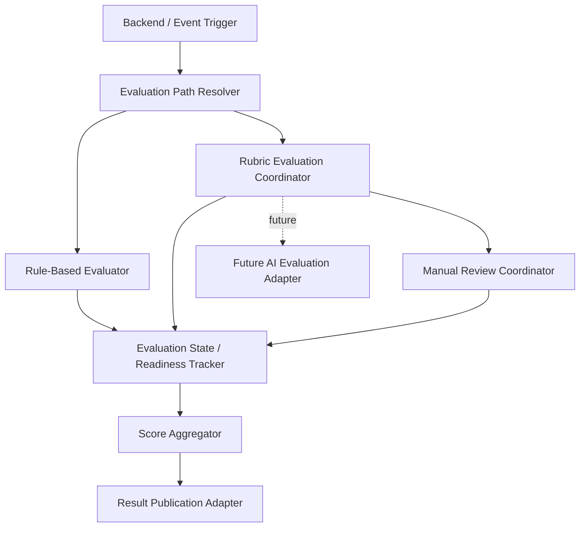
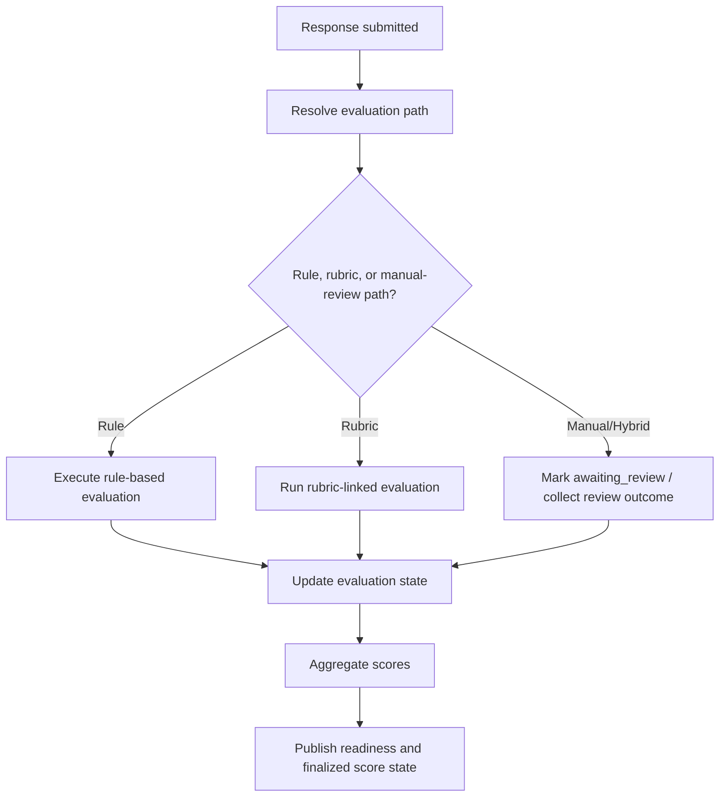
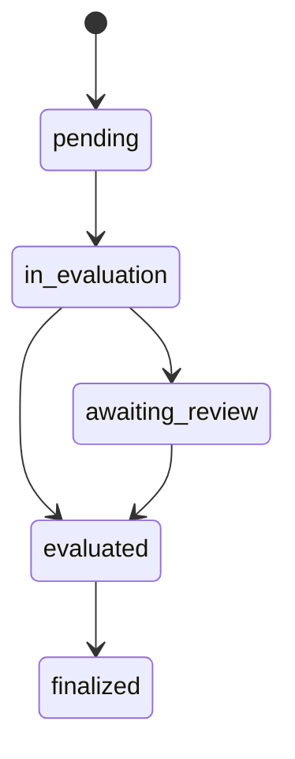

# D-ARCHIE Scoring and Evaluation High-Level Design (HLD)

## 1. Document Overview

### 1.1 Purpose
This document defines the high-level design for the `Scoring and Evaluation` component in D-ARCHIE.

The purpose of this HLD is to define the module that owns:
- evaluation execution,
- score generation,
- review-state tracking,
- score aggregation,
- readiness signaling to orchestration,
- delivery of score outputs to reporting consumers,
- future AI-assisted evaluation extension boundaries.

This HLD establishes Scoring and Evaluation as the source of truth for evaluation execution and score outputs while keeping content ownership, workflow ownership, and reporting ownership outside its boundary.

### 1.2 Audience
This document is written for:
- solution architects,
- backend engineers,
- product and engineering leads,
- assessment-platform designers,
- future LLD authors,
- engineers working on orchestration, content management, reporting, and reviewer-facing workflows.

### 1.3 Relationship to Parent Documents
This component HLD is derived from:
- [`BRD.md`](/Users/varshasingh/Desktop/code_practise/PORTFOLIO/DARCHIE/docs/BRD.md)
- [`Platform-HLD.md`](/Users/varshasingh/Desktop/code_practise/PORTFOLIO/DARCHIE/docs/Platform-HLD.md)
- [`Component-HLD-Blueprint.md`](/Users/varshasingh/Desktop/code_practise/PORTFOLIO/DARCHIE/docs/Component-HLD-Blueprint.md)
- [`Backend-HLD.md`](/Users/varshasingh/Desktop/code_practise/PORTFOLIO/DARCHIE/docs/Backend-HLD.md)
- [`Assessment-Orchestration-HLD.md`](/Users/varshasingh/Desktop/code_practise/PORTFOLIO/DARCHIE/docs/Assessment-Orchestration-HLD.md)
- [`Assessment-Content-Management-HLD.md`](/Users/varshasingh/Desktop/code_practise/PORTFOLIO/DARCHIE/docs/Assessment-Content-Management-HLD.md)

The platform HLD defines scoring as the module responsible for determining and aggregating evaluation outputs. The orchestration HLD already defines that workflow progression depends on score/review readiness but does not compute scores. The content-management HLD defines rubrics and evaluation-linked metadata as content-owned inputs to this component. This document refines Scoring and Evaluation at HLD level.

### 1.4 Scope
This HLD covers:
- evaluation ownership and boundaries,
- hybrid evaluation-path management,
- review-state and readiness-state handling,
- score aggregation responsibilities,
- interfaces to backend, orchestration, content, and reporting,
- evaluation lifecycle and eventing,
- quality attributes and failure considerations,
- handoff points for LLD.

This HLD does not cover:
- rubric authoring,
- runtime workflow progression decisions,
- candidate response storage,
- report rendering or analytics interpretation,
- reviewer UI implementation detail,
- active AI-assisted evaluation in MVP,
- endpoint-level APIs,
- database schema detail.

## 2. Component Summary

### 2.1 Component Name
`Scoring and Evaluation`

### 2.2 Mission Statement
Scoring and Evaluation is the assessment-evaluation engine of D-ARCHIE, responsible for executing the appropriate evaluation path, producing score outputs, tracking review readiness, and publishing finalized results for downstream consumers.

### 2.3 Why This Component Matters
D-ARCHIE is differentiated by evaluating candidates beyond isolated coding tasks. That requires a scoring module that can:
- support different evaluation methods for different task types,
- combine immediate scoring with rubric and manual-review paths,
- maintain evaluation readiness state for workflow gating,
- aggregate outputs across tasks, components, and full assessments,
- produce trustworthy score outputs for recruiter-facing reporting,
- remain extensible for future AI-assisted evaluation.

Without this component, D-ARCHIE would not be able to transform candidate responses into structured, explainable evaluation outcomes.

### 2.4 Role in the Platform
Scoring and Evaluation acts as:
- the system-of-record for evaluation execution state,
- the producer of score outputs,
- the owner of manual-review-supported evaluation state,
- the readiness-state publisher for orchestration,
- the score-output provider for reporting.

It is not the owner of rubrics, authored content definitions, workflow progression, response persistence, or report presentation.

## 3. Goals and Responsibilities

### 3.1 Primary Goals
- support hybrid evaluation in MVP,
- provide clear evaluation-path selection for different task types,
- maintain trustworthy evaluation and review state,
- produce aggregate scoring outputs that can be consumed by reporting,
- support orchestration gating without absorbing workflow ownership,
- preserve extensibility for future AI-assisted evaluation.

### 3.2 Primary Responsibilities
- determine the correct evaluation path per task/component,
- execute rule-based evaluation where applicable,
- coordinate rubric-linked evaluation workflows,
- support first-class manual review paths,
- maintain evaluation lifecycle state,
- maintain score/review readiness state,
- aggregate task-level outputs into component-level and assessment-level scoring outputs,
- store evaluation outputs and review outcomes,
- publish evaluation completion and readiness updates,
- expose finalized score outputs to reporting consumers.

### 3.3 Explicitly Not Owned by This Component
- rubric definition ownership,
- content authoring,
- workflow progression decisions,
- candidate response storage,
- report rendering or recruiter-facing UI behavior,
- AI-assisted evaluation execution in MVP,
- reviewer workbench UI implementation.

## 4. In Scope / Out of Scope

### 4.1 In Scope for MVP
- rule-based evaluation,
- rubric-linked evaluation workflows,
- first-class manual review support,
- evaluation-path selection,
- evaluation status tracking,
- review status tracking,
- score aggregation across levels,
- readiness signaling to orchestration,
- finalized score output delivery to reporting,
- auditability of scoring outcomes and review changes,
- future AI-assisted evaluation boundary definition.

### 4.2 Out of Scope for MVP
- rubric authoring,
- candidate workflow progression control,
- candidate response storage,
- recruiter-facing report composition,
- active AI evaluation execution,
- advanced reviewer workbench UX,
- endpoint/schema-level scoring contracts.

### 4.3 Deferred to Later Phases
- AI-assisted evaluation activation,
- richer reviewer assignment and SLA workflows,
- more advanced adjudication or override models,
- benchmarking and normalization logic,
- score explainability enhancements beyond MVP requirements.

## 5. Actors and Interactions

### 5.1 User Actors
- Reviewer
- Admin or privileged operator in score/review-related contexts
- Recruiter / Hiring Manager indirectly through reporting consumption

### 5.2 Internal Platform Actors
- Backend application shell
- Assessment Orchestration
- Assessment Content Management
- Reporting and Analytics
- Notification / Audit / Support Services

### 5.3 External / Supporting Systems
- relational operational store,
- cache where needed for read optimization,
- event/queue infrastructure,
- observability stack,
- future AI evaluation provider.

### 5.4 Interaction Model Summary
- backend or event-driven triggers invoke scoring after response submission or review action,
- scoring consumes rubric-linked metadata and evaluation context from content management,
- orchestration consumes readiness and completion state from scoring,
- reporting consumes finalized score outputs and aggregates,
- reviewer-related score changes update scoring state but do not alter orchestration ownership.

## 6. Component Boundaries and Dependencies

### 6.1 Boundary Definition
Scoring and Evaluation begins when a response, evaluation request, review update, or score query enters the evaluation domain, and ends when score state, review state, readiness state, or aggregated result output has been resolved and persisted.

It owns:
- evaluation execution,
- score output generation,
- review-required state,
- review completion state,
- aggregation of score outputs,
- evaluation completion signaling.

It does not own:
- rubric definitions,
- workflow progression actions,
- raw response storage,
- reporting presentation,
- authored assessment structure.

### 6.2 Upstream Dependencies
Upstream callers include:
- backend API paths,
- event consumers reacting to response submission,
- reviewer-related actions routed through backend,
- orchestration status checks.

### 6.3 Downstream Dependencies
Scoring and Evaluation depends on:
- Assessment Content Management for rubric definitions and evaluation-linked metadata,
- persistence layers for evaluation state and score storage,
- orchestration as a consumer of readiness signals,
- reporting as a consumer of finalized results,
- audit/event infrastructure,
- optional future AI evaluation provider.

### 6.4 Synchronous Interactions
- evaluation status lookup,
- score retrieval,
- rubric/evaluation-metadata retrieval,
- readiness-state retrieval,
- aggregate score retrieval.

### 6.5 Asynchronous Interactions
- response-submitted evaluation triggers,
- evaluation-started/evaluation-completed events,
- review-requested/review-completed events,
- score-finalized publication,
- future AI-evaluation trigger flows.

### 6.6 Critical Dependency Rules
- content management owns rubrics and authored evaluation metadata,
- scoring owns evaluation execution and output state,
- orchestration consumes readiness state but does not compute scores,
- reporting consumes finalized outputs but does not own evaluation logic,
- AI evaluation remains a future pluggable extension, not an MVP dependency.

## 7. Internal Logical Decomposition

The component should be logically organized into the following capability areas.

### 7.1 Evaluation Path Resolver
Responsible for:
- determining the correct evaluation path,
- selecting between rule-based, rubric-based, and manual-review-supported flows,
- using task and rubric metadata to drive evaluation path selection.

### 7.2 Rule-Based Evaluator
Responsible for:
- executing deterministic, rule-based evaluation,
- producing immediate score outputs where objective evaluation is possible,
- returning evaluation completion state quickly for eligible tasks.

### 7.3 Rubric Evaluation Coordinator
Responsible for:
- coordinating rubric-linked evaluation flows,
- retrieving rubric-linked metadata,
- aligning evaluation execution with authored rubric structure,
- routing to reviewer/manual steps where required.

### 7.4 Manual Review Coordinator
Responsible for:
- tracking review-required cases,
- capturing manual-review-supported evaluation state,
- tracking reviewer completion and changes,
- supporting first-class hybrid review paths.

### 7.5 Score Aggregator
Responsible for:
- aggregating task-level outputs,
- producing component-level scoring outputs,
- producing assessment-level scoring summaries,
- keeping aggregate outputs aligned with review updates and overrides.

### 7.6 Evaluation State / Readiness Tracker
Responsible for:
- tracking evaluation lifecycle state,
- tracking readiness state for orchestration,
- maintaining the distinction between evaluated, awaiting review, and finalized outputs.

### 7.7 Result Publication Adapter
Responsible for:
- exposing finalized score outputs to reporting,
- publishing evaluation completion and score-finalization events,
- exposing readiness updates to orchestration.

### 7.8 Future AI Evaluation Adapter
Responsible for:
- preserving a pluggable integration boundary for future AI-assisted evaluation,
- keeping future AI execution outside MVP scoring internals,
- ensuring future AI support can coexist with review and audit requirements.

### 7.9 Internal Logical Decomposition Diagram

## 8. Evaluation and Review Flows

### 8.1 Response Received and Evaluation Path Selection

Flow:
1. Response submission or evaluation trigger reaches scoring.
2. Evaluation Path Resolver loads the relevant evaluation metadata.
3. Scoring determines whether the response should follow:
   - rule-based evaluation,
   - rubric-linked evaluation,
   - manual-review-supported evaluation,
   - hybrid path.
4. Evaluation state moves from `pending` to `in_evaluation`.

### 8.2 Immediate Rule-Based Scoring Flow

Flow:
1. Rule-Based Evaluator executes deterministic evaluation logic.
2. A score output is generated at task level.
3. Evaluation State / Readiness Tracker marks the evaluation as complete.
4. Score Aggregator updates component- or assessment-level aggregates if relevant.
5. Result Publication Adapter publishes readiness and score-finalized updates where appropriate.

### 8.3 Rubric / Manual-Review Scoring Flow

Flow:
1. Rubric Evaluation Coordinator retrieves rubric-linked metadata from content management.
2. The response is evaluated against rubric-linked requirements.
3. If manual review is needed, Manual Review Coordinator marks the item as `awaiting_review`.
4. When review is completed, score outputs are recorded or updated.
5. Evaluation state advances toward `evaluated` or `finalized` depending on review requirements.

### 8.4 Readiness Update Back to Orchestration

Flow:
1. Evaluation State / Readiness Tracker updates readiness state.
2. Scoring publishes evaluation-complete or review-complete signals.
3. Orchestration consumes readiness updates and decides whether progression may continue.
4. Scoring does not make progression decisions itself.

### 8.5 Component / Assessment Score Aggregation

Flow:
1. Task-level score outputs are produced.
2. Score Aggregator combines outputs into higher-level score summaries.
3. Aggregated results are updated if later review changes occur.
4. Finalized outputs are made available to reporting consumers.

### 8.6 Result Availability for Reporting

Flow:
1. Reporting requests or subscribes to finalized scoring outputs.
2. Result Publication Adapter provides finalized score and aggregate outputs.
3. Reporting consumes the data without taking ownership of evaluation logic.

### 8.7 Score Update Behavior on Review Change or Override

Flow:
1. Reviewer outcome changes or overrides a prior evaluation result.
2. Manual Review Coordinator records the update.
3. Evaluation State / Readiness Tracker updates the evaluation lifecycle state.
4. Score Aggregator recalculates affected higher-level aggregates.
5. Result Publication Adapter republishes final score state as needed.

### 8.8 Primary Evaluation Flow Diagram

### 8.9 Optional Evaluation Lifecycle State Diagram

The exact evaluation and review state-transition rules are deferred to LLD.

## 9. High-Level Interfaces and Contracts

This section defines scoring-facing architectural contracts, not detailed APIs.

### 9.1 Interfaces Provided by Scoring and Evaluation

#### Backend / Event Layer -> Scoring and Evaluation
High-level operations:
- start evaluation,
- fetch evaluation status,
- fetch score outputs,
- update review outcomes,
- retrieve finalized or aggregate results.

Interaction type:
- synchronous status retrieval plus asynchronous evaluation triggers.

#### Assessment Orchestration -> Scoring and Evaluation
High-level operations:
- fetch score/review readiness state,
- query evaluation completion,
- consume evaluation outcome state for progression gating.

Interaction type:
- synchronous status lookup plus asynchronous completion signals.

#### Reporting -> Scoring and Evaluation
High-level operations:
- retrieve finalized score outputs,
- retrieve aggregate evaluation results.

Interaction type:
- synchronous retrieval and/or event-driven consumption.

### 9.2 Interfaces Consumed by Scoring and Evaluation

#### Scoring and Evaluation -> Assessment Content Management
High-level operations:
- fetch rubric definitions,
- fetch evaluation-linked task metadata,
- fetch published assessment context needed for evaluation.

Interaction type:
- synchronous request/response.

#### Scoring and Evaluation -> Persistence / Audit Boundaries
High-level operations:
- store evaluation state,
- store score outputs,
- store review records,
- store audit markers,
- persist aggregate results.

Interaction type:
- synchronous persistence plus asynchronous event/audit emission.

#### Scoring and Evaluation -> Future AI Evaluation Boundary
High-level operations:
- future pluggable evaluation invocation,
- future AI-assisted evaluation result intake,
- future audit-friendly AI evaluation trace handling.

Interaction type:
- future optional integration only.

### 9.3 Events Emitted or Consumed

Events consumed:
- `response_submitted`
- `review_completed`
- optional review-update or override triggers

Events emitted:
- `evaluation_started`
- `evaluation_completed`
- `review_requested`
- `review_completed`
- `score_finalized`

## 10. Domain Concepts and Data Ownership

### 10.1 Platform Concepts Owned by Scoring and Evaluation
- `Score`
- `Review`

It also owns:
- evaluation execution state,
- readiness state,
- aggregation outcomes tied to assessment evaluation.

### 10.2 Platform Concepts Referenced but Not Owned
- `Response`
- `Rubric`
- `Task`
- `Component`
- `Assessment`
- `Assessment Version`
- `Result Summary`

### 10.3 System-of-Record Responsibilities
Scoring and Evaluation is system-of-record for:
- evaluation execution state,
- task-level score outputs,
- component-level and assessment-level score aggregation outputs,
- manual-review readiness and completion status,
- review-linked score updates and finalization state.

Scoring and Evaluation is not system-of-record for:
- rubric definitions,
- response artifacts,
- workflow progression state,
- recruiter-facing report presentation.

### 10.4 Persistence Responsibilities
Scoring and Evaluation writes or coordinates writes to:
- relational operational storage for score, review, and evaluation state,
- cache where read performance benefits from it,
- event/queue infrastructure for readiness and completion signaling,
- audit/observability channels for evaluation traceability.

### 10.5 Records / Artifacts Produced
- evaluation state records,
- task/component/assessment score outputs,
- review records,
- readiness markers,
- score-finalization markers,
- aggregate evaluation outputs,
- audit markers for evaluation and review changes.

## 11. Security, Reliability, Scalability, and Observability

### 11.1 Security
- evaluation and review data must be protected from unauthorized access,
- privileged review or override actions must be auditable,
- score outputs should not be mutable by unauthorized callers,
- future AI evaluation paths must preserve reviewability and auditability.

### 11.2 Reliability
- evaluation runs must tolerate retries without corrupting score state,
- manual-review-supported flows must preserve correctness across delayed updates,
- aggregation must remain consistent when review updates modify prior task outputs,
- readiness signaling must be durable enough for orchestration to depend on.

### 11.3 Scalability
- immediate rule-based scoring should remain lightweight,
- long-running or manual-review-supported evaluation should not block interactive request paths,
- score aggregation should scale with assessment volume,
- future AI-assisted evaluation should be attachable without redesigning the scoring boundary.

### 11.4 Observability
- trace evaluation lifecycle transitions,
- log evaluation-path selection and readiness changes,
- monitor pending and awaiting-review backlogs,
- record audit trails for manual review and score overrides.

## 12. Risks and Failure Considerations

### 12.1 Likely Failure Modes
- incorrect evaluation-path selection,
- stale rubric-linked metadata causing inconsistent scoring,
- manual review delays causing prolonged waiting states,
- aggregation inconsistency after review changes,
- readiness updates failing to reach orchestration,
- ambiguity between score finalization and report consumption timing.

### 12.2 Architectural Risks
- scoring may become over-coupled to content definitions if rubric retrieval is not clearly bounded,
- manual review can become under-specified if not treated as first-class in design,
- aggregation logic can become difficult to reason about if task- and higher-level outputs are not separated clearly,
- future AI support may create auditability gaps if not kept behind an explicit extension boundary.

### 12.3 Mitigation Direction
- keep evaluation execution separate from content authorship,
- treat manual review as a real scoring path in MVP,
- model readiness and finalization states explicitly in LLD,
- separate raw evaluation outputs from aggregated outputs,
- keep AI integration optional and bounded.

## 13. Deferred Decisions for LLD

The following decisions are intentionally deferred to LLD:
- exact evaluation-state and review-state enums,
- exact score formulas and aggregation rules,
- exact review assignment mechanics,
- override/adjudication behavior,
- API contract shapes,
- schema design for score and review storage,
- retry/idempotency behavior for evaluation execution,
- event payload definitions,
- cache and read-model details,
- explainability output shape for reviewer/admin consumers.

## 14. Handoff to LLD

The LLD for Scoring and Evaluation should define:
- evaluation and review entities,
- exact evaluation-path selection logic,
- score and aggregation models,
- evaluation-state and review-state machines,
- readiness signaling rules,
- API contracts,
- event contracts,
- persistence schema,
- review update and override behavior,
- idempotency and retry logic,
- finalization conditions for reporting consumption.

## 15. Acceptance Checklist

This HLD is acceptable if:
- scoring ownership is clearly separated from orchestration and content management,
- all three MVP evaluation paths are visible and distinct,
- manual review is treated as first-class,
- readiness-state signaling to orchestration is clear,
- aggregation ownership is clearly placed in scoring,
- reporting consumption is visible without transferring evaluation ownership,
- AI-assisted evaluation is visible only as a future extension boundary,
- deferred decisions are explicit enough for LLD work.

## 16. Future Extension Points

### 16.1 AI-Assisted Evaluation
Future versions may add AI-assisted evaluation for selected assessment components.

Architectural position:
- explicit future extension boundary,
- not active MVP execution,
- must remain auditable and review-compatible.

### 16.2 Richer Reviewer Workflows
Future versions may add:
- reviewer assignment,
- multi-stage review,
- adjudication,
- SLA tracking,
- escalation flows.

### 16.3 Advanced Benchmarking and Scoring Models
Future versions may support normalized scoring, benchmarking, and richer score interpretation models.

## 17. Executive Summary

Scoring and Evaluation is the D-ARCHIE evaluation engine. It owns evaluation execution, score generation, review-state tracking, score aggregation, and readiness signaling to orchestration and reporting consumers.

It supports hybrid evaluation in MVP through rule-based scoring, rubric-linked evaluation flows, and first-class manual review. It consumes rubric and evaluation-linked metadata from content management, while orchestration consumes only readiness and outcome state.

This HLD defines the component boundary required to turn candidate responses into structured, auditable evaluation outputs while keeping workflow, content, and reporting ownership cleanly separated.
